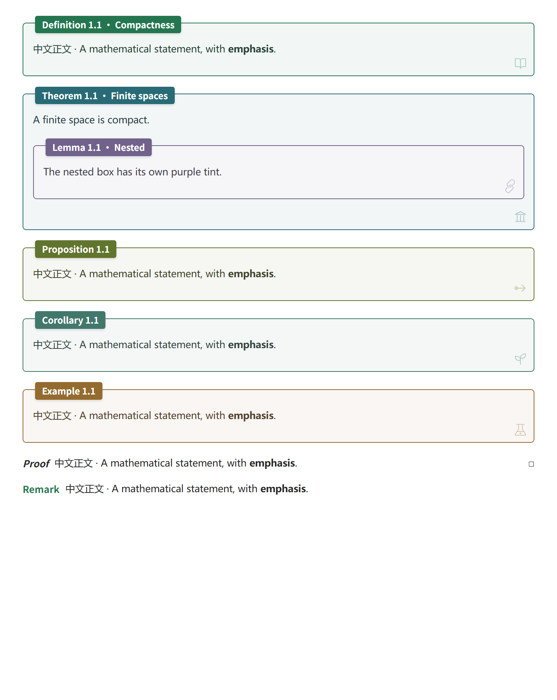
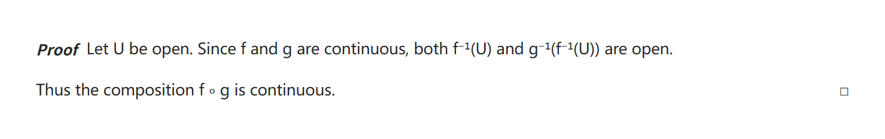
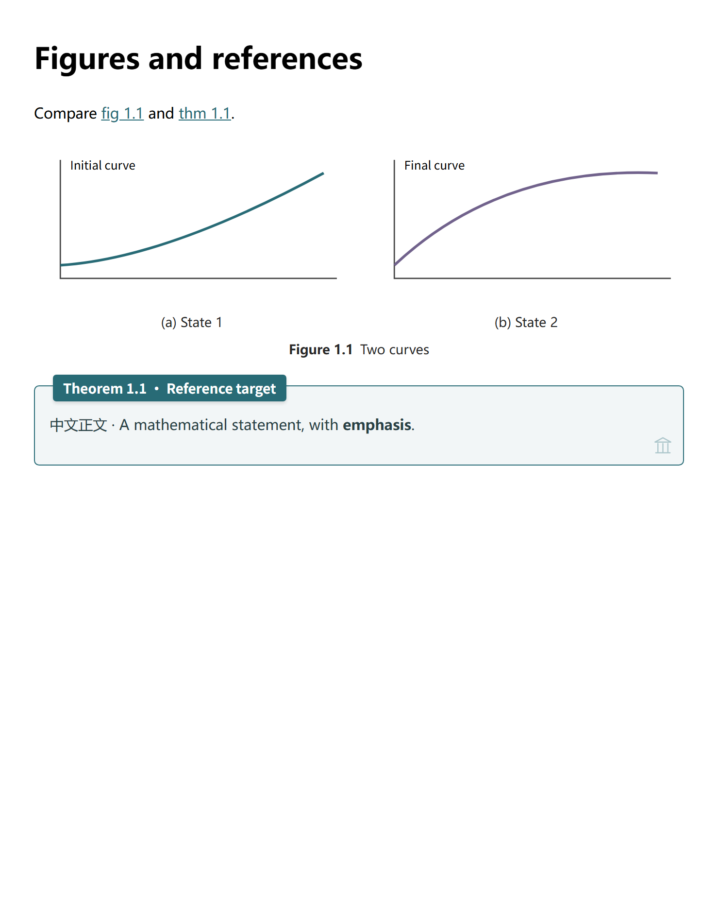
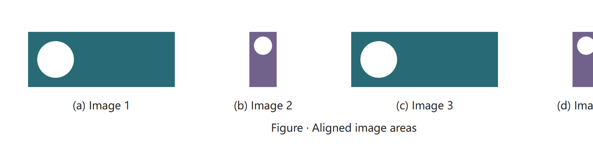
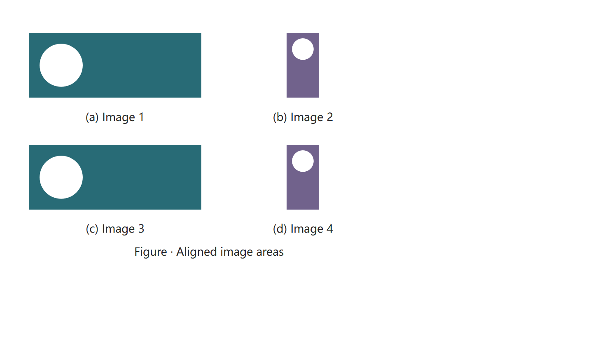
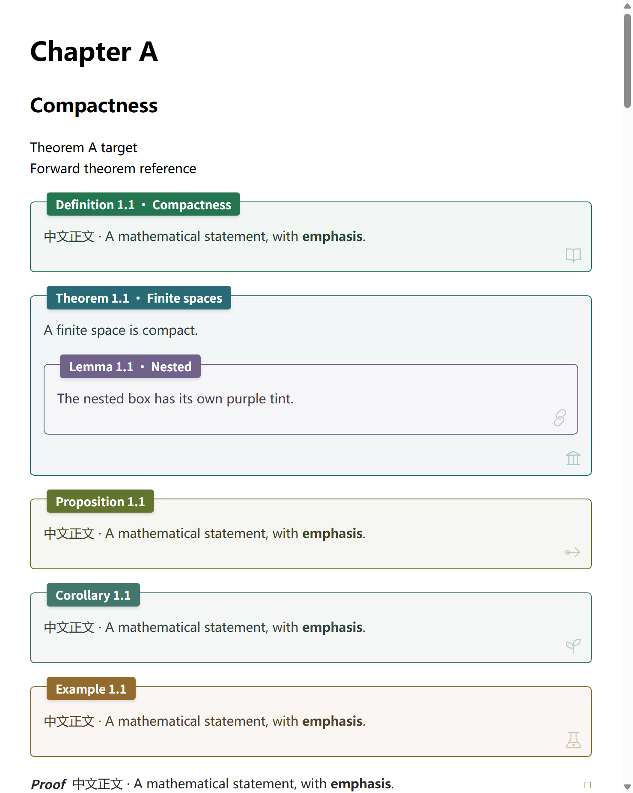

# Academic Notes

**English** | [简体中文](README.zh-CN.md)

LaTeX-like numbering, cross-references, figures, tables, and local PDF export for Obsidian.

The mathematical environments are visually inspired by [ElegantBook](https://github.com/ElegantLaTeX/ElegantBook): framed theorems, simple proofs with an end-of-proof square, and remarks with an inline colored title. Colors follow the selected Academic Notes palette.



## Features

- Number theorems, definitions, lemmas, equations, figures, tables, and subfigures automatically or manually.
- Reference blocks across notes, with reference suggestions and an option to number only referenced equations.
- Choose light and dark color palettes, style nested callouts, and use three-line tables.
- Write borderless proofs with an automatic QED square and remarks with a palette-matched title.
- Add clickable tables of contents, PDF bookmarks, and measured PDF page numbers.
- Export a single note or a multi-note book to PDF or HTML without modifying the source notes.
- Process notes locally, without telemetry, an account, or a separately installed export engine.

## Installation

Requires **Obsidian desktop 1.9.0 or later**. Download `main.js`, `manifest.json`, and `styles.css` from the [latest release](https://github.com/Kristal-Boltinn/academic-notes/releases/latest), then place them in your vault:

```text
.obsidian/plugins/academic-notes/
├─ main.js
├─ manifest.json
└─ styles.css
```

Enable **Academic Notes** under **Settings → Community plugins**. Figure and table styles are included; no CSS snippet is required. PDF export uses Obsidian's bundled Electron, so no Python or separate Chrome installation is needed.

### Interface language

The interface follows **Obsidian → Settings → General → Language** automatically. Chinese locales use Simplified Chinese; English and other languages use English. Restart Obsidian after changing its language. Settings, dropdowns, commands, dialogs, diagnostics and export messages are translated. Your note text, custom titles, reference syntax and saved settings are preserved.

For standalone table and caption styling without automatic numbering, copy [academic-layout.css](snippets/academic-layout.css) into `.obsidian/snippets/` and enable it under Appearance. Avoid enabling duplicate styles alongside the plugin.

## Quick start: theorems and references

```markdown
## Continuous maps

> [!def] Continuity
> A map is continuous if the inverse image of every open set is open.

^def-continuity

> [!thm] Composition
> The composition of two continuous maps is continuous.

^thm-composition

Use [[#^def-continuity]] to prove [[#^thm-composition]].

> [!proof]
> Take inverse images successively.
```

By default, these display as `Definition 1.1 · Continuity` and `Theorem 1.1 · Composition`. References display `def 1.1` and `thm 1.1` and navigate to their targets. Each environment type has its own counter unless shared counters are enabled.

| Environment | Accepted callout types | Numbered |
|---|---|---|
| Definition | `def`, `definition` | Yes |
| Theorem | `thm`, `theorem` | Yes |
| Lemma | `lem`, `lemma` | Yes |
| Proposition | `prop`, `proposition`, `prp` | Yes |
| Corollary | `cor`, `corollary` | Yes |
| Claim | `claim`, `clm` | Yes |
| Example | `example`, `ex`, `exa`, `exm` | Yes |
| Axiom | `axiom`, `axm` | Yes |
| Assumption | `assumption`, `asm` | Yes |
| Exercise | `exercise`, `exr` | Yes |
| Conjecture | `conjecture`, `cnj` | Yes |
| Hypothesis | `hypothesis`, `hyp` | Yes |
| Proof | `proof`, `pf` | No |
| Remark | `remark`, `rem`, `rmk` | No |
| Solution | `solution`, `sol` | No |

Use `> [!thm]- Title` for an initially collapsed callout, or `> [!thm]+ Title` for an expanded one. Add another `>` for each nesting level. Export expands collapsed content.

- Manual number: `> [!thm|A.1] Title`.
- No number: `> [!thm|*] Title`. `|-` and empty metadata `|` also suppress numbering.
- Automatic number: omit metadata or use `|auto`. Automatic counters avoid manual numbers already used in the same scope.

## Proofs and remarks

Use a `proof` callout for an unnumbered proof. Its italic **Proof** label sits beside the first paragraph; a hollow square **□** appears at the end automatically. You do not need to type the square.

```markdown
> [!proof]
> Let $U$ be open. Since $f$ and $g$ are continuous, both
> $f^{-1}(U)$ and $g^{-1}(f^{-1}(U))$ are open.
>
> Thus the composition $f \circ g$ is continuous.
```



A `remark` callout has an inline title in a brighter shade of the selected palette's main hue, with ordinary text underneath or beside it. It has no frame, shaded background, or QED square.

```markdown
> [!remark]
> The argument only uses inverse images of open sets.
> It applies to arbitrary topological spaces.
```


Both environments use normal note text color for their content. `pf` is an alias for `proof`; `rem` and `rmk` are aliases for `remark`. Add a title such as `> [!proof] Composition` or use the usual `+`/`-` folding syntax. They support nested callouts and multi-paragraph content. If a proof starts with a list or display equation, its title occupies a separate line; if it ends with one, the square follows on its own final line. Long proofs can continue across PDF pages, with a single square at the end.

## Equation numbering

```markdown
## An identity

$$
a^2+b^2=c^2
$$

^eq-example

See [[#^eq-example]].
```

By default, only display equations referenced in the indexed vault receive automatic numbers; unreferenced equations do not consume a number. You can number all display equations or disable automatic numbering. Inline math is not numbered.

Manual `\tag{A}` values are preserved. Without a manual tag, `\notag` or `\nonumber` suppresses automatic numbering. Each display-math block receives at most one automatic number; split it into separate blocks for separate references. Blocks containing multiple manual tags retain the original math without guessing a single reference number.

## References and commands

```markdown
Same note: [[#^thm-composition]]
Another note: [[Chapter One#^thm-composition]]
Custom label: [[Chapter One#^thm-composition|composition theorem]]
Markdown link: [composition theorem](Chapter%20One.md#^thm-composition)
```

Block IDs use letters, digits, and hyphens and must be unique within a note. Leave a blank line after the block and place `^id` on its own line. For nested blocks, use the add-ID command to avoid assigning an ID to the wrong nesting level.

Open the command palette (`Ctrl+P` on Windows) and search for **Academic Notes**:

| Action | Command label |
|---|---|
| Add a unique block ID at the cursor | Add a block ID to the current equation, theorem or figure |
| Select a target and insert its reference | Insert theorem, equation or figure reference |
| Rebuild the index and refresh references | Rebuild index and refresh references |
| Export the current note as PDF | Export current note to PDF |
| Export the current note as HTML | Export current note to HTML snapshot |
| Select notes and export a book | Select notes and export a PDF book |
| Export a book from a manifest | Export phb-book manifest to PDF |
| Open diagnostics | Check plugin status and export environment |

Type `\ref`, `\tref`, or `\eqref` for reference suggestions. The latter two filter to mathematical callouts or equations. Reading view and Live Preview replace reference labels; Source mode preserves the syntax. Moving the cursor into a reference in Live Preview also reveals its source. Custom aliases are preserved by default.

## Numbering settings

| Setting | Behavior |
|---|---|
| Reset at H2 headings (default) | Every source `##` starts a new counter scope; H3–H6 do not reset it. |
| Include H2 section number | Displays `2.1` instead of `1`; turning this off still allows section resets. |
| H2 number source | Use heading order, or prefer a leading number such as `## 3.2 Title`. |
| Continuous numbering | Count throughout the note without H2 resets or section prefixes. |
| Shared theorem counter | Mathematical environments share a counter; equations, figures, and tables remain separate. |
| Number prefix | Set explicitly; no prefix is inferred from dates or filenames. |
| Excluded paths | One vault-relative file or directory per line. |

With H2 headings, material before the first H2 belongs to section 0. If a note has no H2 headings, section numbers are omitted. Headings inside code, math, or comments do not start sections.

Equation references default to `eq:{number}`; mathematical callouts use `{type} {number}`. `{type}` follows the abbreviation setting, `{abbr}` is always abbreviated, and `{name}` is always the full name. `{title}` and `{file}` are also available. Figures and tables default to `fig {number}` and `tab {number}`.

## Figures, tables, and subfigures

Write captions in callout titles. Figure captions appear below images; table captions appear above three-line tables. Replace image paths with files in your vault.

```markdown
> [!figure] Function curve
> ![[Attachments/curve.svg]]

^fig-curve

> [!table] Parameters
> | Parameter | Value |
> | --- | --- |
> | $a$ | 1 |
> | $b$ | 2 |

^tab-parameters

See [[#^fig-curve]] and [[#^tab-parameters]].
```

Subfigures must be nested inside a main figure:

```markdown
> [!figure] Two states
> > [!subfigure] Initial state
> > ![[Attachments/initial.svg]]
>
> ^fig-initial
>
> > [!subfigure] Final state
> > ![[Attachments/final.svg]]
>
> ^fig-final

^fig-states
```

Subfigures display `(a)`, `(b)`, etc.; `[[#^fig-initial]]` can render as `fig 1.1(a)`. Layout wraps in narrow windows. An orphan subfigure keeps its caption and produces a warning. Aliases `fig`, `tbl`, and `subfig` are supported. Use explicit callouts for figures and tables; ordinary image alt text and H6 headings are not captions.



Optional note properties:

```yaml
---
cssclasses:
  - academic-serif
  - academic-indent
---
```

`academic-serif` uses local serif fonts. `academic-indent` indents ordinary paragraphs, excluding callouts and lists. `academic-keep-table-style` preserves the theme's table styling.

An untitled subfigure (`> [!subfigure]` with nothing after the closing bracket) shows only its image when it is not referenced: no letter and no empty caption row. It does not consume a letter, so the next titled subfigure starts at `(a)`. An existing block ID alone does not require a caption. If a link actually references that ID, or a manual number is supplied, a label remains available. Explicit folding controls remain usable on screen; empty captions are removed from PDF export.

### Quick insertion and group layout

Run **Academic Notes: Insert academic environment** from the command palette, or assign it a hotkey under Obsidian's Hotkeys settings. Choose a theorem, definition, proof, remark, single figure, subfigure group or table. Groups offer 2–12 images, a maximum column count and an optional shared image height. The command inserts before the current line (before the enclosing quote block when inside a callout), preserves existing text, selects the title and generates block IDs that do not collide with the current note. Replace the sample image paths with your own attachments. Edit the generated Markdown freely afterward.

Place group options on the **outer figure**, for example:

```markdown
> [!figure|cols=auto height=180] Comparison
> > [!subfigure] Wide image
> > ![[Attachments/wide.png]]
>
> > [!subfigure] Tall image
> > ![[Attachments/tall.png]]
```

- `cols=auto`: two images use up to two columns, four use up to four, and other counts use up to three. Four columns switch directly to two, then one; four-image groups never wrap as 3+1. Rows retain equal cell widths; a final partial row is centered.
- `cols=1`, `2`, `3` or `4`: cap the column count. Narrow figures still reduce columns; a four-column cap also skips three columns. The figure's own width controls wrapping, including split panes and PDF pages.
- `height=180` or `height=180px`: use the same target height of 180 pixels for every subfigure. Images stay proportional and fully visible. If the widest image cannot fit its column, the entire group uses the same reduced height. This explicitly overrides individual `![[image.png|300]]` widths inside this group. It is a shared image height, not a crop or a guarantee of equal visible artwork height. Accepted range: 16–1200 pixels; very tall groups may exceed a printed page.
- Omit `height` to preserve individual image-width settings. These options apply to subfigures inside this group, not ordinary images. Invalid layout values are ignored. Combine with existing numbering metadata, e.g. `|A.1 cols=2 height=180` or `|* cols=2`.





For abbreviation expansion, the optional [LaTeX Suite snippets](examples/latex-suite-snippets.js) provide `subfig2`, `subfig3`, `subfig4`, `subfig6`, `athm`, `aproof` and `aremark`. Merge the entries into your existing snippets array, type a trigger on a blank top-level line and press Tab; further Tab presses move between fields. See [LaTeX Suite's instructions](https://github.com/artisticat1/obsidian-latex-suite/blob/main/DOCS.md). Snippets do not create IDs; use Academic Notes' add-block-ID command when a reference is needed. The built-in insertion command needs no other plugin.

## Appearance

Light palettes: Forest (default), Sakura, Mint, Sky, Mauve, Golden, Cherry, and Prussian. Dark palettes: Radiation (default), Vampire, and Abyss. Each palette assigns colors by environment type. Light/dark mode follows **Obsidian's current mode**, which can itself follow the operating system.

The **follow Obsidian theme colors** option uses the theme's public accent for definitions, blue for theorems/claims, purple for lemmas, green for propositions, cyan for corollaries, orange for examples, and secondary text color for solutions, mixed with normal text color. Remark titles use a brighter tone of the definition color; proof titles use normal text color. It does not choose a preset automatically or read the operating system's accent directly. Select a fixed palette to control border and fill colors independently of the theme.

**Use normal text color inside callouts** makes framed callout text match ordinary note text. When disabled, 36% of the callout color is mixed in. Proof and remark content always uses normal text color. Links and code keep their own styles.

Framed callouts mix 6% callout color with 94% white in light mode, or 8% callout color with 92% neutral dark gray in dark mode. Nested callouts use their own colors. The corner decoration can be hidden; this does not hide a proof's QED square. The optional Style Settings plugin can adjust borders and corner radii.

## Table of contents

Write `[toc]` as a standalone paragraph, or specify a depth:

````markdown
```academic-toc
3
```
````

Depths 1–6 are supported; omission uses the setting. Note TOCs are clickable. PDF TOCs use measured printed page positions and include bookmarks.

## PDF, HTML, and book export

Use the export commands listed above. HTML is a static snapshot; re-export after editing a note. The multi-note selection dialog lets you choose notes, change their order, and edit chapter titles.

Alternatively, create a book manifest note:

```yaml
---
phb-book:
  title: Analysis Notes
  subtitle: A sample collection
  tocDepth: 3
  files:
    - Chapter One.md
    - path: Chapter Two.md
      title: Continuity
---
```

`phb-book` is a chapter list in the note's YAML properties. It is unnecessary for single-note export or the multi-note selection dialog. Open the manifest and run the manifest PDF or HTML command. Paths are relative to the vault root; list order determines chapter order. The manifest itself is not included as a chapter.

Book numbering supports **chapter.section.number** (default, e.g. `2.3.1`), **chapter.number** (continuous per chapter), or **preserve vault numbering** (which may repeat across chapters). In chapter.section mode, material before the first H2 or in a chapter without H2 belongs to section 0. Renumbering affects export copies only. Include cross-file targets in the export; otherwise the report flags unresolved references.

Enable theme-and-snippet capture to include current CSS, or disable it to use built-in callout, figure, and print styles. Both retain the current light/dark mode and palette. Collapsed callouts expand, long callouts may span pages, and wide SVG math scales to the available width.

Outputs default to `_exports/` inside the vault. Only vault-relative output directories are accepted; absolute paths and `..` are rejected. Exports include timestamped HTML snapshots, snapshot reports, PDFs, and pagination reports. TOC calibration allows up to six passes. Export stops if calibration does not converge or if image, math, font, or internal-link validation fails.



## Privacy and permissions

- Markdown is indexed locally to resolve cross-file references, with configurable exclusions. No account, telemetry, or developer server is involved; note contents are not sent to the developer.
- The installed plugin does not install software, launch external commands, or download runtime dependencies. Printing and PDF post-processing run locally.
- The installed plugin does not use the Node filesystem API. PDF printing loads the snapshot as an in-memory Blob in an isolated hidden window; it does not create temporary HTML files outside the vault. Node integration, document scripts, network requests, local-file requests, and permission requests are disabled in that window. External hyperlinks can remain in PDFs without being visited during export.
- To preserve appearance, snapshots may read locally loaded CSS, fonts, and images, including local files outside the vault referenced by a theme. They are embedded in the local snapshot. Disabling theme capture reduces theme-resource access.
- Final exports and reports are written only to the configured directory inside the vault. Reports may contain paths, note titles, and warnings; review them before public sharing. Do not publish your local `data.json` settings file.
- Save remote images to the vault first. Export does not download remote images or CSS. Obsidian's and other plugins' network behavior is outside this plugin's control.
- Indexing and export do not rewrite notes. The add-ID and insert-reference commands edit the current note when invoked.

## Troubleshooting

The export progress window shows errors. Afterwards, open diagnostics and inspect `errors` and `lastPdfExport`. Use **Save diagnostic JSON to export folder** to save diagnostics, normally to `_exports/academic-diagnostics-*.json`. Error history lasts for the current plugin session, so save it before reloading.

`pdf.interfaceAvailable` only checks whether the interface exists; it does not prove export succeeded. A successful export creates `.report.json`; on failure, a `.phb.html` snapshot may already exist. For more logs, open Developer Tools (`Ctrl+Shift+I` on Windows) and search the Console for `[Academic Notes]`.

| Problem | What to check |
|---|---|
| Equation has no number | Referenced-only is the default. Check its ID, references, excluded paths, and `\notag`. |
| Reference label is unchanged | Custom aliases are preserved; Source mode shows original syntax; duplicate IDs do not resolve. |
| Callout/figure styling is wrong | Disable duplicate numbering plugins or CSS snippets and check the callout type. |
| Unexpected colors | Check theme-following mode; normal-text-color affects text only. |
| Electron interface is unavailable | Run diagnostics and update the Obsidian desktop installer. |
| PDF export fails | Inspect progress and diagnostics; ensure local images, math, and fonts load correctly. |
| Numbering is stale | Run the rebuild-index command. |

This plugin is desktop-only. The minimum app version is an API requirement, not a guarantee that every OS, theme, and plugin combination has been tested. Native PDF access depends on Electron interfaces exposed by Obsidian desktop and should be retested after application updates.

## Development

Use Node.js 22 or later:

```sh
npm ci
npm test
npm run lint
npm run build
npm run test:electron
npm run check:release
```

`npm ci` installs development dependencies, including the Electron test runtime; the installed plugin never runs it. `npm run dev` watches source files. TypeScript lives in `src/`; esbuild bundles pdf-lib and fallback CSS. Distribution requires only `main.js`, `manifest.json`, and `styles.css`.

Styles are maintained in `src/styles/callouts.css` (environments and TOC), `src/styles/ui.css` (plugin controls), `src/styles/document.css` (export layout), and `snippets/academic-layout.css` (figures and tables). The build flattens CSS nesting and uses the same compiled callout styles in the release and export snapshots.

`examples/` contains synthetic notes and images, including [proofs and remarks](examples/proof-and-remark.md). Native tests launch a hidden standalone Electron window, save README screenshots to `screenshots/`, and write PDFs and reports into `output/`. They verify Chromium printing and styles, but do not replace testing inside Obsidian. Set `ACADEMIC_TEST_THEME` to a local theme stylesheet path for additional compatibility checks. Linux CI uses Xvfb and configures Electron's sandbox helper; see [ci.yml](.github/workflows/ci.yml).

For releases, update `package.json`, the lockfile, `manifest.json`, `versions.json`, and the changelog together. Push a tag matching the manifest version. GitHub Actions tests and builds the plugin, checks reproducibility, and creates a draft release with three installable assets. See [RELEASING.md](RELEASING.md).

## License

[MIT](LICENSE). Dependency licenses are listed in [THIRD-PARTY-NOTICES.md](THIRD-PARTY-NOTICES.md).
