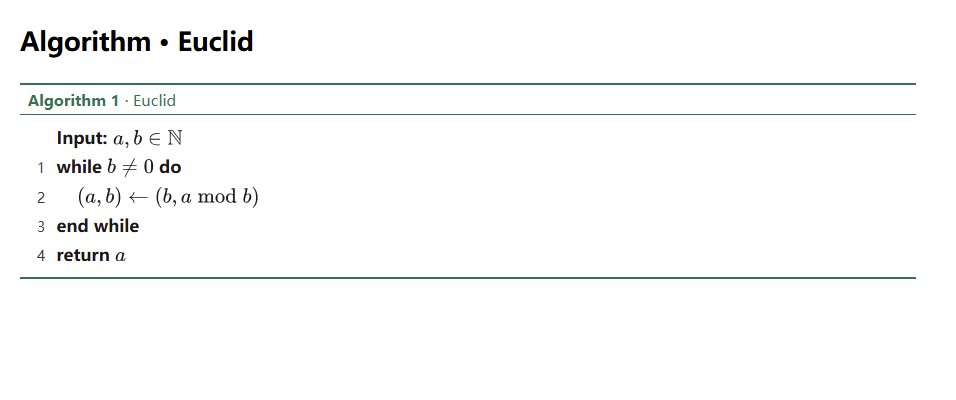
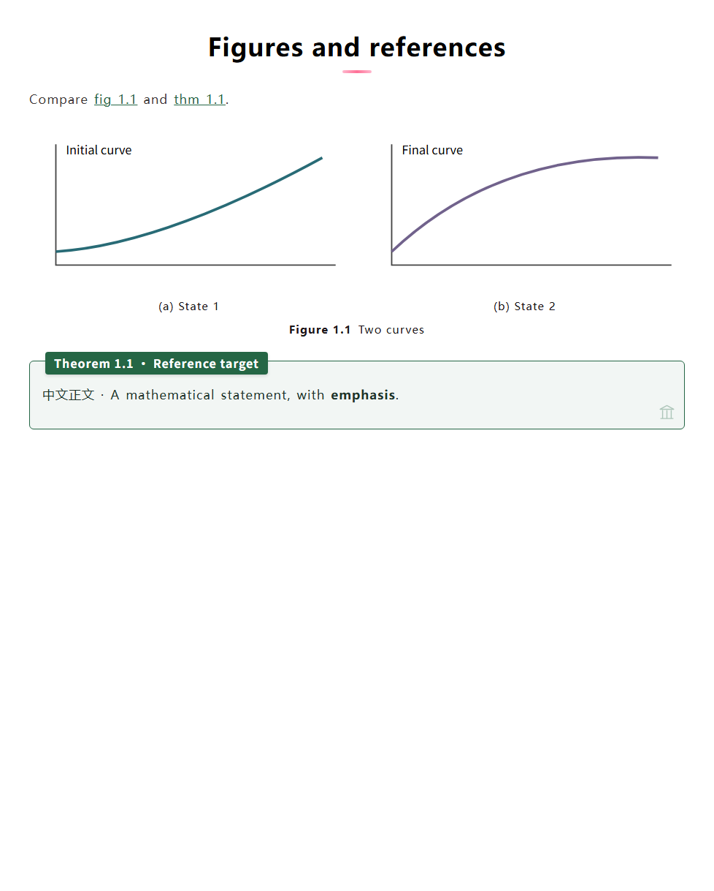
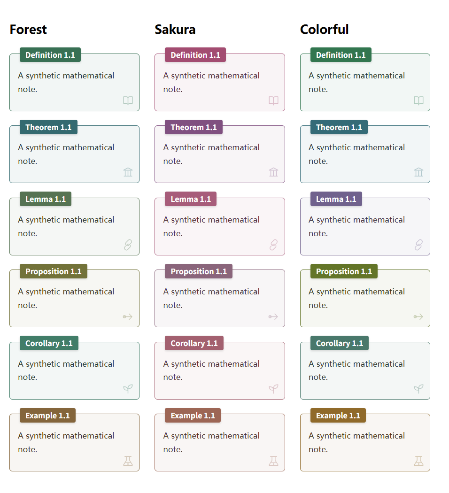
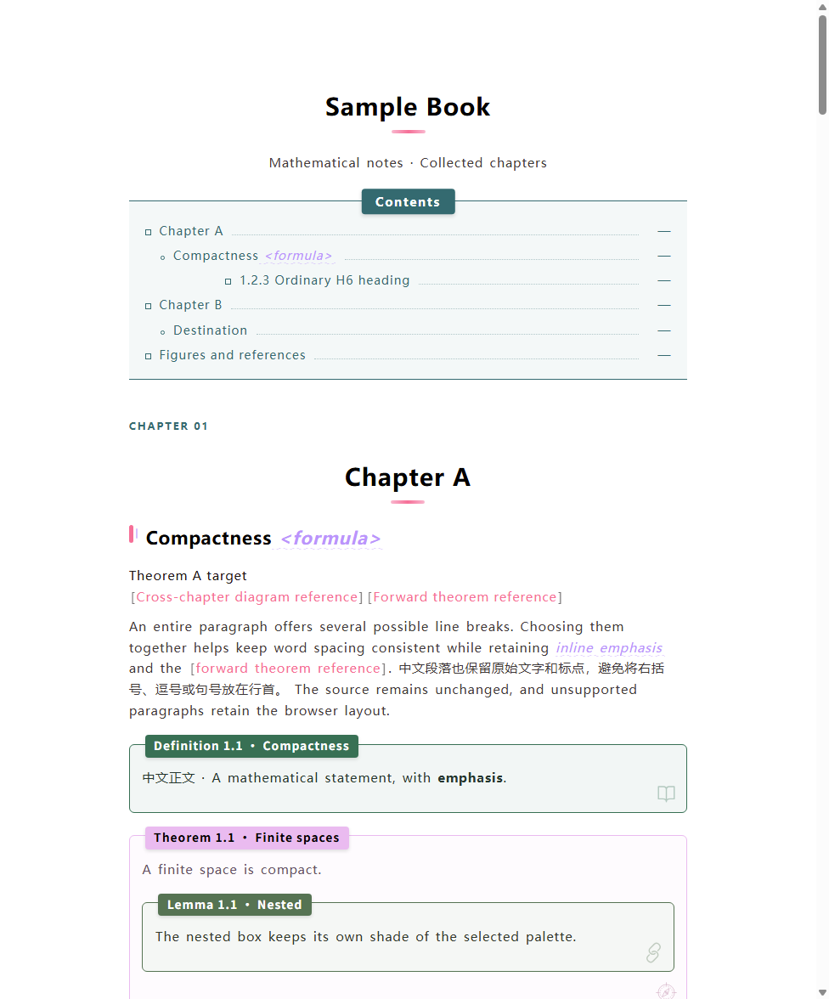

# Academic Notes

**English** | [简体中文](README.zh-CN.md)

LaTeX-like numbering, cross-references, figures, tables, and local PDF export for Obsidian.

The mathematical environments are visually inspired by [ElegantBook](https://github.com/ElegantLaTeX/ElegantBook): framed theorems, simple proofs with an end-of-proof square, and remarks with an inline colored title. Colors follow the selected Academic Notes palette.


## Features

- Number theorems, definitions, lemmas, equations, figures, tables, subfigures and algorithms automatically or manually.
- Reference blocks across notes, with reference suggestions and an option to number only referenced equations.
- Choose light and dark color palettes, style nested callouts, and use three-line tables.
- Write borderless proofs with an automatic QED square and remarks with a palette-matched title.
- Draw commutative diagrams with a local grid editor (Beta), or use the optional TikZJax integration.
- Add clickable tables of contents, PDF bookmarks, and measured PDF page numbers.
- Export a single note or a multi-note book to PDF or HTML without modifying the source notes.
- Optionally use Knuth–Plass paragraph line breaking in Reading view, inactive Live Preview prose, and desktop PDF exports (Beta).
- Optionally reduce PDF page gaps with selectable 80% shrinking and safe paragraph movement (experimental).
- Process notes locally, without telemetry, an account, or a separately installed export engine.

## Installation

Requires **Obsidian 1.9.0 or later** on desktop or mobile. Install Academic Notes from Community plugins when it is listed for your device, or download `main.js`, `manifest.json`, and `styles.css` from the [latest release](https://github.com/Kristal-Boltinn/academic-notes/releases/latest) and place them in your vault:

```text
.obsidian/plugins/academic-notes/
├─ main.js
├─ manifest.json
└─ styles.css
```

Enable **Academic Notes** under **Settings → Community plugins**. Figure and table styles are included; no CSS snippet is required. The same plugin runs on iPad and desktop. On mobile, numbering, cross-file references, the table of contents, academic environments, settings and HTML snapshot commands remain available. PDF export and its commands run only on desktop, using Obsidian's bundled Electron; no Python or separate Chrome installation is needed.

### Interface language

The interface follows **Obsidian → Settings → General → Language** automatically. Chinese locales use Simplified Chinese; English and other languages use English. Restart Obsidian after changing its language. Settings, dropdowns, commands, dialogs, diagnostics and export messages are translated. Your note text, custom titles, reference syntax and saved settings are preserved.

For standalone table and caption styling without automatic numbering, copy [academic-layout.css](snippets/academic-layout.css) into `.obsidian/snippets/` and enable it under Appearance. Avoid enabling duplicate styles alongside the plugin.

## Quick start: theorems and references

```markdown
## Continuous maps

> [!def] Continuity
> A map is continuous if the inverse image of every open set is open.

^def-continuity

> [!thm] Composition
> The composition of two continuous maps is continuous.

^thm-composition

Use [[#^def-continuity]] to prove [[#^thm-composition]].

> [!proof]
> Take inverse images successively.
```

By default, these display as `Definition 1.1 · Continuity` and `Theorem 1.1 · Composition`. References display `def 1.1` and `thm 1.1` and navigate to their targets. Each environment type has its own counter unless shared counters are enabled.

| Environment | Accepted callout types | Numbered |
|---|---|---|
| Definition | `def`, `definition` | Yes |
| Theorem | `thm`, `theorem` | Yes |
| Lemma | `lem`, `lemma` | Yes |
| Proposition | `prop`, `proposition`, `prp` | Yes |
| Corollary | `cor`, `corollary` | Yes |
| Claim | `claim`, `clm` | Yes |
| Example | `example`, `ex`, `exa`, `exm` | Yes |
| Axiom | `axiom`, `axm` | Yes |
| Assumption | `assumption`, `asm` | Yes |
| Exercise | `exercise`, `exr` | Yes |
| Conjecture | `conjecture`, `cnj` | Yes |
| Hypothesis | `hypothesis`, `hyp` | Yes |
| Proof | `proof`, `pf` | No |
| Remark | `remark`, `rem`, `rmk` | No |
| Solution | `solution`, `sol` | No |

Use `> [!thm]- Title` for an initially collapsed callout, or `> [!thm]+ Title` for an expanded one. Add another `>` for each nesting level. Export expands collapsed content.

- Manual number: `> [!thm|A.1] Title`.
- No number: `> [!thm|*] Title`. `|-` and empty metadata `|` also suppress numbering.
- Automatic number: omit metadata or use `|auto`. Automatic counters avoid manual numbers already used in the same scope.

## Proofs and remarks

Use a `proof` callout for an unnumbered proof. If the opening line has no title, **Proof** occupies its own line and the argument starts below. A hollow square **□** appears at the end automatically. A custom title or reference can sit beside the first paragraph; add an empty quoted line after the header to start the argument below it.

```markdown
> [!proof]
> Let $U$ be open. Since $f$ and $g$ are continuous, both
> $f^{-1}(U)$ and $g^{-1}(f^{-1}(U))$ are open.
>
> Thus the composition $f \circ g$ is continuous.
```

To prove a previously stated theorem, lemma or claim, put its block reference directly after the marker:

```markdown
> [!proof][[Chapter one#^claim-a]]
> Here is the argument.
```

This displays **Proof of clm 1.1**, with a clickable reference. `> [!proof] [[#^thm-a]]` works too. The reference follows numbering settings, aliases and book chapter renumbering. Use the block ID of the mathematical environment as the target.


A `remark` callout has an inline title in a brighter shade of the selected palette's main hue, with ordinary text underneath or beside it. It has no frame, shaded background, or QED square.

```markdown
> [!remark]
> The argument only uses inverse images of open sets.
> It applies to arbitrary topological spaces.
```


Both environments use normal note text color for their content. `pf` is an alias for `proof`; `rem` and `rmk` are aliases for `remark`. Add a title such as `> [!proof] Composition` or use the usual `+`/`-` folding syntax. They support nested callouts and multi-paragraph content. If a proof starts with a list or display equation, its title occupies a separate line; if it ends with one, the square follows on its own final line. Long proofs can continue across PDF pages, with a single square at the end.

## Equation numbering

```markdown
## An identity

$$
a^2+b^2=c^2
$$

^eq-example

See [[#^eq-example]].
```

By default, only display equations referenced in the indexed vault receive automatic numbers; unreferenced equations do not consume a number. You can number all display equations or disable automatic numbering. Inline math is not numbered.

Manual `\tag{A}` values are preserved. Without a manual tag, `\notag` or `\nonumber` suppresses automatic numbering. Each display-math block receives at most one automatic number; split it into separate blocks for separate references. Blocks containing multiple manual tags retain the original math without guessing a single reference number.

## References and commands

```markdown
Same note: [[#^thm-composition]]
Another note: [[Chapter One#^thm-composition]]
Custom label: [[Chapter One#^thm-composition|composition theorem]]
Markdown link: [composition theorem](Chapter%20One.md#^thm-composition)
```

Block IDs use letters, digits, and hyphens and must be unique within a note. Leave a blank line after the block and place `^id` on its own line. For nested blocks, use the add-ID command to avoid assigning an ID to the wrong nesting level.

Open the command palette (`Ctrl+P` on Windows) and search for **Academic Notes**:

| Action | Command label |
|---|---|
| Add a unique block ID at the cursor | Add a block ID to the current equation, theorem or figure |
| Select a target and insert its reference | Insert theorem, equation or figure reference |
| Rebuild the index and refresh references | Rebuild index and refresh references |
| Insert or reopen a commutative diagram | Insert or edit commutative diagram (Beta) |
| Export the current note as PDF | Export current note to PDF |
| Export the current note as HTML | Export current note to HTML snapshot |
| Select notes and export a book | Select notes and export a PDF book |
| Export a book from a manifest | Export phb-book manifest to PDF |
| Open diagnostics | Check plugin status and export environment |

Type `\ref`, `\tref`, or `\eqref` for reference suggestions. The latter two filter to mathematical callouts or equations. Reading view and Live Preview replace reference labels; Source mode preserves the syntax. Moving the cursor into a reference in Live Preview also reveals its source. Custom aliases are preserved by default.

## Settings overview

**Overall palette** stays at the top of every settings page. Below it are four tabs: **Environments** (select or create an environment, then edit its name, reference, colors and motifs in one place), **Numbering and reference defaults**, **Paragraph typography**, and **Contents and export**. Only the Knuth–Plass subsection is marked Beta. Appearance edits keep the current scroll position; native dropdown pickers close after selection. The grouped interface uses the compatible settings-display path on Obsidian 1.13 and 1.14.

## Numbering settings

| Setting | Behavior |
|---|---|
| Reset at H2 headings (default) | Every source `##` starts a new counter scope; H3–H6 do not reset it. |
| Include H2 section number | Displays `2.1` instead of `1`; turning this off still allows section resets. |
| H2 number source | Use heading order, or prefer a leading number such as `## 3.2 Title`. |
| Continuous numbering | Count throughout the note without H2 resets or section prefixes. |
| Shared theorem counter | Mathematical environments share a counter; equations, figures, and tables remain separate. |
| Number prefix | Set explicitly; no prefix is inferred from dates or filenames. |
| Excluded paths | One vault-relative file or directory per line. |

With H2 headings, material before the first H2 belongs to section 0. If a note has no H2 headings, section numbers are omitted. Headings inside code, math, or comments do not start sections.

Equation references default to `eq:{number}`; mathematical callouts use `{type} {number}`. `{type}` follows the abbreviation setting, `{abbr}` is always abbreviated, and `{name}` is always the full name. `{title}` and `{file}` are also available. Figures and tables default to `fig {number}` and `tab {number}`.

## Custom environment names and references

In **Settings → Academic Notes → Environments**, select any environment and set:

- **Display name**: the name in its heading and full-name references, in any language (for example, `Satz`, `算法`, or `Observación`).
- **Reference abbreviation**: for example, `S.`, `算`, or `obs`. The default algorithm/figure/table/equation reference prefixes also respect this field.
- **Reference format for this environment**: an optional override such as `{abbr} {number}`, `{name} {number}`, or `算法 {number}`. Available placeholders: `{type}`, `{abbr}`, `{name}`, `{number}`, `{title}`, `{file}`.

Figures, tables, algorithms and equations have one format editor here. The field shows its inherited default as a placeholder; existing saved formats continue to apply. **Numbering and reference defaults → Default reference format for theorem environments** only supplies the shared fallback for theorems, definitions and lemmas. A format entered for one environment takes priority over that fallback.

Click **Save**. Empty fields use defaults; **Reset to default** clears only the selected environment’s overrides. Explicit link aliases remain unchanged when **Respect handwritten link aliases** is enabled. These settings change displayed text; existing `^block-ids` and wikilink destinations stay valid.

### Add a new Markdown environment

In the same environment selector, choose **New environment**. For example, set ID `observation`, display name `Observation`, abbreviation `obs`, base appearance `Lemma`, and enable automatic numbering. After saving, its colors and motifs appear in the same editor. Changes belong to the palette selected above; without an override, the environment follows its base appearance. Click **Save**, then write:

```markdown
> [!observation] Compactness
> A mathematical observation with inline math $x\in K$.

^obs-compact

See [[#^obs-compact]].
```

The new environment appears in **Insert academic environment**. It has an independent counter when shared theorem counters are disabled, follows the same section/chapter rules when exporting books, and supports cross-file references and PDF links. Choose `Remark` for an unboxed heading. The **Automatic numbering** switch controls the new environment; the global theorem numbering switch still applies. `[!observation|*]` suppresses one instance’s number; `[!observation|A]` supplies a manual number.

IDs must start with a lowercase English letter and use only lowercase letters, digits and hyphens (up to 40 characters). Built-in IDs and aliases are reserved. Up to 64 custom environments are supported. Saved IDs cannot be renamed: create another environment to use a different ID. Deleting a definition leaves the original note text intact; its callouts revert to ordinary Obsidian callouts on the next native render. Custom environments reuse the existing mathematical-box/Remark layout and Markdown body; they do not define new pseudocode grammars or LaTeX macros.

## Algorithms and pseudocode

Write algorithms using the [pseudocode.js](https://github.com/SaswatPadhi/pseudocode.js) / LaTeX `algorithmic` grammar. The grammar is bundled; no Pseudocode plugin or external rendering service is required. Choose either wrapper below. They share one renderer, an independent algorithm counter, cross-file references and PDF output.

### Callout form

```markdown
> [!algorithm] Euclid
> \INPUT $a,b\in\mathbb{N}$
> \WHILE{$b\ne 0$}
>   \STATE $(a,b)\gets(b,a\bmod b)$
> \ENDWHILE
> \RETURN $a$

^alg-euclid

See [[#^alg-euclid]].
```

The callout title becomes the caption; the `algorithmic` wrapper is implicit. Preserve every `>` prefix. Foldable `[!algorithm]+` and `[!algorithm]-` retain native Obsidian folding. The body is pseudocode, rather than ordinary Markdown: use `$...$` or `\(...\)` for formulas and `\textbf{...}` for bold text. A nonempty callout title overrides a caption inside a supplied full environment.

### Code-block form

````markdown
```algorithm
\begin{algorithm}
\caption{Euclid}
\begin{algorithmic}
\INPUT $a,b\in\mathbb{N}$
\WHILE{$b\ne 0$}
  \STATE $(a,b)\gets(b,a\bmod b)$
\ENDWHILE
\RETURN $a$
\end{algorithmic}
\end{algorithm}
```

^alg-euclid

See [[#^alg-euclid]].
````

Use distinct block IDs when placing both examples in one note. To migrate from the optional Pseudocode plugin, change its `pseudo` fence to `algorithm`; existing `pseudo` blocks remain owned by that plugin. This implements the pseudocode.js grammar, rather than every command from `algorithm2e` or arbitrary LaTeX packages. Each block contains one algorithmic environment and at most one caption. A bare `algorithmic` environment or its body is also accepted.

### Supported syntax and settings

| Purpose | Commands |
| --- | --- |
| Inputs and outputs | `\INPUT`, `\OUTPUT`, `\REQUIRE`, `\ENSURE` |
| Statements and comments | `\STATE`, `\RETURN`, `\PRINT`, `\COMMENT{...}` |
| Conditionals | `\IF{...}`, `\ELIF{...}` / `\ELSIF{...}` / `\ELSEIF{...}`, `\ELSE`, `\ENDIF` |
| Loops | `\FOR{...}` / `\FORALL{...}` … `\ENDFOR`, `\WHILE{...}` … `\ENDWHILE`, `\REPEAT` … `\UNTIL{...}` |
| Functions | `\FUNCTION{name}{args}` … `\ENDFUNCTION`, `\PROCEDURE{name}{args}` … `\ENDPROCEDURE`, `\CALL{name}{args}` |
| Other controls | `\BREAK`, `\CONTINUE`, `\UPON{...}` … `\ENDUPON` |
| Inline logic | `\AND`, `\OR`, `\NOT`, `\TRUE`, `\FALSE`, `\TO`, `\DOWNTO` |

Commands are case-insensitive, except the usual case-sensitive LaTeX font sizes. Put input/output declarations before the control-flow body. Use the **Insert academic environment** command and choose **Algorithm (callout)** or **Algorithm (code block)** for a ready-to-edit template and unique ID.

- **Automatically number algorithms** follows the current section/whole-note scope; theorems, equations and figures have separate counters. Book export re-numbers algorithms with the selected chapter scheme and resolves links across selected chapters.
- **Show algorithm line numbers** is the master switch for every algorithm, independent of caption numbering. Turning it off removes all line numbers and their gutter, even with `lines=true` or `\begin{algorithmic}[1]`. With it on, `[!algorithm|lines=false]` or `\begin{algorithmic}[0]` disables numbers for one block; `lines=true` / `[1]` follows the enabled master switch. Input/output declarations and comments do not consume a line number. `[!algorithm|*]` suppresses the caption number; `[!algorithm|A]` supplies a manual number.
- **Algorithm reference format** defaults to `alg {number}` and supports the same placeholders as theorem references. References use `[[#^alg-euclid]]` or `[[Other note#^alg-euclid]]`.
- **Environments → Algorithm** changes the rules and the complete caption, including the algorithm title. Body/formula text stays neutral, keywords are bold, and line numbers/comments use muted text. Traditional heavy–thin–heavy rules match the three-line table style.
- Reading view and inactive Live Preview callouts render algorithms. Native editing remains available when entering the source/title; no note text is rewritten. Algorithm rows are excluded from prose KP and first-line indentation.
- Desktop PDF export keeps short algorithms together; blocks exceeding the printable height split between complete rows. HTML snapshots include static formulas and styles. Syntax errors are displayed locally and stop export, avoiding a silently incomplete PDF. Formula layout remains subject to the available page width.



## Figures, tables, and subfigures

Write captions in callout titles. Figure captions appear below images; table captions appear above three-line tables. Replace image paths with files in your vault.

```markdown
> [!figure] Function curve
> ![[Attachments/curve.svg]]

^fig-curve

> [!table] Parameters
> | Parameter | Value |
> | --- | --- |
> | $a$ | 1 |
> | $b$ | 2 |

^tab-parameters

See [[#^fig-curve]] and [[#^tab-parameters]].
```

Subfigures must be nested inside a main figure:

```markdown
> [!figure] Two states
> > [!subfigure] Initial state
> > ![[Attachments/initial.svg]]
>
> ^fig-initial
>
> > [!subfigure] Final state
> > ![[Attachments/final.svg]]
>
> ^fig-final

^fig-states
```

Subfigures display `(a)`, `(b)`, etc.; `[[#^fig-initial]]` can render as `fig 1.1(a)`. Layout wraps in narrow windows. An orphan subfigure keeps its caption and produces a warning. Aliases `fig`, `tbl`, and `subfig` are supported. Use explicit callouts for figures and tables; ordinary image alt text and H6 headings are not captions.



Optional note properties:

```yaml
---
cssclasses:
  - academic-serif
  - academic-indent
---
```

`academic-serif` uses local serif fonts. `academic-indent` indents ordinary paragraphs, excluding callouts and lists. `academic-keep-table-style` preserves the theme's table styling.

An untitled subfigure (`> [!subfigure]` with nothing after the closing bracket) shows only its image when it is not referenced: no letter and no empty caption row. It does not consume a letter, so the next titled subfigure starts at `(a)`. An existing block ID alone does not require a caption. If a link actually references that ID, or a manual number is supplied, a label remains available. Explicit folding controls remain usable on screen; empty captions are removed from PDF export.

### Quick insertion and group layout

Run **Academic Notes: Insert academic environment** from the command palette, or assign it a hotkey under Obsidian's Hotkeys settings. Choose a theorem, definition, proof, remark, single figure, subfigure group or table. Groups offer 2–12 images, a maximum column count and an optional shared image height. The command inserts before the current line (before the enclosing quote block when inside a callout), preserves existing text, selects the title and generates block IDs that do not collide with the current note. Replace the sample image paths with your own attachments. Edit the generated Markdown freely afterward.

Place group options on the **outer figure**, for example:

```markdown
> [!figure|cols=auto height=180] Comparison
> > [!subfigure] Wide image
> > ![[Attachments/wide.png]]
>
> > [!subfigure] Tall image
> > ![[Attachments/tall.png]]
```

- `cols=auto`: two images use up to two columns, four use up to four, and other counts use up to three. Four columns switch directly to two, then one; four-image groups never wrap as 3+1. Rows retain equal cell widths; a final partial row is centered.
- `cols=1`, `2`, `3` or `4`: cap the column count. Narrow figures still reduce columns; a four-column cap also skips three columns. The figure's own width controls wrapping, including split panes and PDF pages.
- `height=180` or `height=180px`: use the same target height of 180 pixels for every subfigure. Images stay proportional and fully visible. If the widest image cannot fit its column, the entire group uses the same reduced height. This explicitly overrides individual `![[image.png|300]]` widths inside this group. It is a shared image height, not a crop or a guarantee of equal visible artwork height. Accepted range: 16–1200 pixels; PDF export proportionally reduces oversized groups to fit the page, subject to the picture-pagination limits below.
- Omit `height` to preserve individual image-width settings. These options apply to subfigures inside this group, not ordinary images. Invalid layout values are ignored. Combine with existing numbering metadata, e.g. `|A.1 cols=2 height=180` or `|* cols=2`.


For abbreviation expansion, the optional [LaTeX Suite snippets](examples/latex-suite-snippets.js) provide `subfig2`, `subfig3`, `subfig4`, `subfig6`, `athm`, `aproof` and `aremark`. Merge the entries into your existing snippets array, type a trigger on a blank top-level line and press Tab; further Tab presses move between fields. See [LaTeX Suite's instructions](https://github.com/artisticat1/obsidian-latex-suite/blob/main/DOCS.md). Snippets do not create IDs; use Academic Notes' add-block-ID command when a reference is needed. The built-in insertion command needs no other plugin.

## Commutative diagrams (Beta)


1. Run **Academic Notes: Insert or edit commutative diagram (Beta)** from the command palette. Choose a 2×2 or 3×3 grid.
2. Click a point to enable/select it, then enter its **Node formula**, such as `M \otimes_R N`. Disable a point with **Enable selected node**. Labels accept bare TeX such as `\alpha`, `$\alpha$`, or `\(\alpha\)`. Obsidian's SVG math is retained when available; a bundled local TeX/AMS-to-SVG renderer handles hosts that return CommonHTML instead. No extra plugin or network connection is needed.
3. Choose **Connect arrows**, then click the source and target. Tap an arrow in the preview or its list button to select it, enter a label, choose a solid/dashed line, or move the label above/below or left/right. **Delete selected arrow** removes that arrow. **Undo** restores recent changes, including nodes removed by shrinking the grid.
4. To show that a triangular diagram commutes, connect **A → B**, **B → C** and **A → C**, then choose **Mark commutativity** and click **A**, **B**, **C** in that order. A short quarter-circle arrow appears inside the triangle. Tap the curve or its list button to select it; **Delete selected commutativity marker** removes it. Removing a required node or arrow also removes its marker. **Undo** restores recent changes.
5. Optionally enter a **Caption**, then click **Save diagram**. The result is stored in an `academic-diagram` JSON code block. Use **Edit diagram** to reopen it, or **Delete diagram** to remove it directly from reading view or Live Preview, without opening source mode.

The Beta supports straight arrows, one arrow per ordered pair, 2×2/3×3 grids, single-line labels up to 200 characters, and up to 12 triangular commutativity markers. The three nodes must be non-collinear and the three directed arrows must exist. Markers express your intended equality; the editor does not prove it. Curves are placed automatically inside the triangle; manual placement and more general path markers are not yet supported. Formulas and arrows share SVG coordinates, including in narrow mobile views. Diagrams render locally in reading view and Live Preview and are preserved in HTML/PDF exports.

Standalone diagrams share the **Figure** counter with ordinary pictures, in source order. A caption is optional. New diagrams receive a unique `^fig-diagram-N` block ID; reference them with `[[#^fig-diagram-1]]` or a cross-file link. For older diagrams, add an ID after the code fence manually or with the add-block-ID command. A diagram already inside a `figure` or `subfigure` callout uses its enclosing caption and is not counted twice. Deleting a standalone diagram also removes its adjacent owned block ID. A complete editable example is in [examples/commutative-diagram.md](examples/commutative-diagram.md).

## TikZ with the optional TikZJax plugin

Install and enable [TikZJax](https://github.com/artisticat1/obsidian-tikzjax) from Obsidian's Community plugins. Use **Insert academic environment → TikZ (TikZJax)** for a starter block, or write:

````markdown
```tikz
\usepackage{tikz}
\begin{document}
\begin{tikzpicture}
  \node (A) at (0,0) {$A$};
  \node (B) at (3,0) {$B$};
  \draw[->] (A) -- (B) node[midway,above] {$f$};
\end{tikzpicture}
\end{document}
```
````

TikZJax also offers `tikz-cd` for handwritten commutative-diagram source; follow its documentation for supported packages. Academic Notes waits up to 60 seconds for its SVG, preserves glyph references across multiple diagrams/chapters, and includes the completed drawing in HTML/PDF. If TikZJax is missing or rendering does not finish, export stops with an explanatory error. Put a `tikz` block inside a `figure` callout to add a numbered caption.

## Appearance

Start with **Overall palette** at the top of Settings:

- **Curated presets:** Forest combines leafy greens, teal and muted earth tones; Sakura combines rose, plum and dusty pink. Mint, Sky, Mauve, Golden, Cherry, Prussian, Radiation, Vampire and Abyss offer other coordinated ranges. Colors vary by environment within each palette.
- **Colorful:** the original distinct role colors, including purple lemmas and green propositions. Available in light and dark modes.
- **Follow theme accent:** every role derives from Obsidian’s public `--text-accent`, with lighter/darker and neighbouring tonal variations. Changing the host accent updates the palette automatically. This does not guess a named preset or read the operating system’s accent directly.
- **Custom palettes:** expand **Custom palettes and reset**, name a copy and click **Create palette**. It starts from the selected preset and its overrides; edit each environment freely and independently.

Light and dark palettes are selected separately and switch with **Obsidian’s current appearance mode**. The **Palette mode to edit** selector chooses which one you are modifying; the status line identifies both the edited palette and the palette currently used by notes. Forest is the light default and Radiation the dark default. The color overview shows the complete selected palette. Fixed presets remain independent of the host accent.

**Neutral callout body text** keeps framed environment prose the same color as ordinary notes. Disabling it mixes in 36% of the current frame color. Proof and Remark bodies remain neutral. This changes neither the font nor headings, borders or fills; links and code retain their own styles.



Framed callouts mix 6% callout color with 94% white in light mode, or 8% callout color with 92% neutral dark gray in dark mode. Nested callouts use their own colors. The corner decoration can be hidden; this does not hide a proof's QED square. The optional Style Settings plugin can adjust border width, corner radius (0 means square corners), motif size and opacity.

Open **Settings → Academic Notes**, select the overall palette, then use **Environments**:

1. Select your light and dark palettes, then choose the **Palette mode to edit**. The editor operates on the palette selected for that mode; the preview shows that palette even if Obsidian currently uses the other mode.
2. Choose a built-in or custom environment. Change **Environment accent** directly with the color picker; no enabling toggle is required. Use its **Default** button to clear just that color override. Changes are stored **only in this palette**: a Forest override does not affect Sakura, and returning to Forest restores its saved override. The accent controls the border, title background and same-hue fill; title text uses black or white for contrast. Proof/Remark remain unframed, with only their title color changing. Algorithm rules and captions default to the palette's primary/definition hue, with neutral body text.
3. For a framed environment, choose a motif and an optional motif color. The gallery contains nine fine-line vector drawings. The global hide-decoration option takes precedence; it never hides the proof's QED square.
4. **Reset this environment** clears its overrides in the edited palette. **Reset this palette** clears all environment overrides in that palette; other palettes remain untouched.
5. Expand **Custom palettes and reset**, enter a name and use **Copy to a custom palette → Create palette** to copy the selected preset and its current overrides. The copy is independently editable. Resetting it returns to its underlying built-in preset (or theme colors); **Delete palette** removes the copy and selects its base.

On upgrade, previous global overrides, including custom-environment colors, migrate to the light and dark palettes selected at the time of upgrading. This preserves the current appearance and lets other presets use their own defaults. Custom colors and motifs are preserved in PDF exports, including when theme capture is disabled.


## Paragraph typography and Knuth–Plass (Beta)


Open **Settings → Academic Notes → Paragraph typography**. The three KP switches and the first-line indentation option are off by default and work independently:

| Setting | Use |
|---|---|
| Indent prose first lines by two characters | Add a visual 2em indent in Reading view, Live Preview and exported documents, including mathematical callout prose. Independent of KP; no spaces are inserted into the note. Headings, lists, code, captions and tables are excluded. |
| Use Knuth–Plass line breaking in Reading view | Optimize prose and mathematical callout bodies in Reading view on desktop or mobile. Recalculate when the available width or fonts change. |
| Use Knuth–Plass line breaking in Live Preview | Optimize inactive, standalone plain-text paragraphs and read-only mathematical callout bodies. Entering with the caret or a selection restores native editing; leaving reoptimizes the paragraph. |
| Use Knuth–Plass line breaking in PDF | Optimize paragraphs at their final printed width when exporting a note or book to PDF on desktop. |

Knuth–Plass considers line breaks across a whole paragraph and adjusts spacing to reduce uneven lines. It supports basic Latin text and CJK characters with common Chinese punctuation rules. Inline links and formulas remain intact; they are treated as units that cannot be split across lines. Enable the Reading view switch, open a note in **Reading view**, and compare its paragraphs at different window widths. First-line indentation reserves space on the left before KP chooses breaks; non-final lines keep the same right edge. A display equation followed immediately by text continues the same paragraph: that text is not indented again. Insert an empty source line after the equation to start a new indented paragraph. An equation block ID does not create a paragraph boundary. No Markdown syntax changes are needed, and the source note is preserved. Source mode keeps its normal editing layout; HTML snapshots keep responsive browser layout.

Proof, Remark, theorem, definition and other mathematical callout bodies use the same solver. Inline headings reserve space on the first line; subsequent lines use the full width. Proof reserves space for a single final QED square, including across PDF pages. Long or multi-line floating headings retain native layout. Optimized non-final lines fill their available width; the final line keeps natural spacing. When inline formulas make fitting difficult, a bounded second pass evaluates the actual visible spacing. Small rendered-width differences are corrected through flexible gaps. At a formula-ending row, presentation wrappers trim theme end margins without modifying the original formula nodes or LaTeX spacing. Formulas remain indivisible: one wider than the remaining space moves to a later line; oversized formulas or unsupported paragraphs retain native layout.


This Beta does not add automatic word hyphenation. Lists, tables, headings, captions, image paragraphs, explicit line breaks, and right-to-left or vertical text use normal browser layout. Complex markup, paragraphs that cannot fit, and content beyond the processing limit also fall back to normal layout; long notes may therefore be only partly optimized. The result depends on the text, font and width, so it will not improve every paragraph.

The **Live Preview** switch keeps a narrower scope for ordinary editable prose: it handles paragraphs written as one source line, surrounded by blank lines (or file boundaries), without inline Markdown formatting. Math, links, emphasis and multiline-source ordinary paragraphs keep native line breaking with browser justification while the Live Preview KP switch is enabled. Active prose also keeps browser justification. Lists and code keep their original layout. This fallback is not a global KP optimization. Read-only mathematical callout bodies also support inline formulas and links. Entering a callout restores its native body; an editable title remains under Obsidian's control. An inactive editable title alone does not exclude its read-only body from KP. A native caret still inside the callout defers further updates even after focus changes. Touch scrolling and momentum must settle before layout resumes. Copy selections defer reflow, and disabling the switch or removing the extension restores native content. All selected paragraphs and IME composition use native editing. Theme letter spacing and word spacing are included in Live Preview width measurements, with a local fallback for older WebKit canvas implementations. Only visible prose is optimized, with bounded work; very large notes retain native layout. It never inserts source line breaks or changes note text. Reading/PDF retain their broader inline-content support.

## Table of contents

Write `[toc]` as a standalone paragraph, or specify a depth:

````markdown
```academic-toc
3
```
````

Depths 1–6 are supported; omission uses the setting. Note TOCs are clickable. PDF TOCs use measured printed page positions and include bookmarks.

## PDF, HTML, and book export

Use the export commands listed above. HTML is a static snapshot; re-export after editing a note. The multi-note selection dialog lets you choose notes, change their order, and edit chapter titles.

Alternatively, create a book manifest note:

```yaml
---
phb-book:
  title: Analysis Notes
  subtitle: A sample collection
  tocDepth: 3
  files:
    - Chapter One.md
    - path: Chapter Two.md
      title: Continuity
---
```

`phb-book` is a chapter list in the note's YAML properties. It is unnecessary for single-note export or the multi-note selection dialog. Open the manifest and run the manifest PDF or HTML command. Paths are relative to the vault root; list order determines chapter order. The manifest itself is not included as a chapter.

Book numbering supports **chapter.section.number** (default, e.g. `2.3.1`), **chapter.number** (continuous per chapter), or **preserve vault numbering** (which may repeat across chapters). In chapter.section mode, material before the first H2 or in a chapter without H2 belongs to section 0. Renumbering affects export copies only. Include cross-file targets in the export; otherwise the report flags unresolved references.

Enable theme-and-snippet capture to include current CSS, or disable it to use built-in callout, figure, and print styles. Both retain the current light/dark mode and palette. Collapsed callouts expand, long callouts may span pages, and wide SVG math scales to the available width.

Outputs default to `_exports/` inside the vault. Only vault-relative output directories are accepted; absolute paths and `..` are rejected. Exports include timestamped HTML snapshots, snapshot reports, PDFs, and pagination reports. TOC calibration allows up to six passes. Export stops if calibration does not converge or if image, math, font, or internal-link validation fails.



### Picture pagination

PDF output uses A4 pages. Figures, subfigure groups and captions stay together when they fit on one page. A group that does not fit in the remaining space moves to the next page. Taller drawings are proportionally reduced to fit the usable page height; individual images are protected too. Very long textual legends can span pages once reducing the pictures is insufficient. The pagination report includes `mediaPagination` counts for protected groups, scaled groups and remaining oversized groups.

### Experimental figure layout

On desktop, open **Settings → Academic Notes → Contents and export → Figure layout priority (experimental)**. The default is **Keep whitespace (off)**. Choose a priority:

| Priority | Behavior |
|---|---|
| Shrink to 80% → move → keep gap | First reduce picture dimensions to 80%. Keep it in place if the complete figure fits; otherwise try filling the gap with following text. |
| Move → shrink to 80% → keep gap | First try advancing following text, then try shrinking. |
| Shrink to 80% only | Reduce picture dimensions if that fills the gap; otherwise keep source order. |
| Move only | Try advancing following text; otherwise keep source order. |

Movement advances at most three consecutive ordinary paragraphs below a standalone `figure`/`fig` callout, leaving the complete picture and caption on the next page. It stops at headings, mathematical environments, lists, tables and other pictures. Figures inside environments are not moved. The experiment measures actual PDF boundaries and rejects changes that split a figure or advanced paragraph; captions retain their font size. Source numbering and notes stay unchanged.

Set **Maximum figure adjustment attempts** to 1, 3, 6 (default) or 10. This is a total limit for the export. If another adjustment is needed after the limit, all experimental adjustments are undone and the normal page gaps remain. Changes are checked again after TOC calibration; invalid boundaries or unstable calibration also restore the normal layout. If normal TOC calibration itself fails, export still reports an error. The pagination report's `figureLayout` records attempts, shrinking, movement, skips and fallback reasons.

This is a bounded experiment for explicit figure callouts. Standalone diagrams, unwrapped images, tables and text-heavy figures do not float automatically; the normal page protection remains active. HTML snapshots retain source order. A synthetic sample is in [examples/figure-floating.md](examples/figure-floating.md).

## Privacy and permissions

- Markdown is indexed locally to resolve cross-file references, with configurable exclusions. No account, telemetry, or developer server is involved; note contents are not sent to the developer.
- The installed plugin does not install software, launch external commands, or download runtime dependencies. Printing and PDF post-processing run locally.
- The installed plugin does not use the Node filesystem API. PDF printing loads the snapshot as an in-memory Blob in an isolated hidden window; it does not create temporary HTML files outside the vault. Node integration, document scripts, network requests, local-file requests, and permission requests are disabled in that window. External hyperlinks can remain in PDFs without being visited during export.
- To preserve appearance, snapshots may read locally loaded CSS, fonts, and images, including local files outside the vault referenced by a theme. They are embedded in the local snapshot. Disabling theme capture reduces theme-resource access.
- Final exports and reports are written only to the configured directory inside the vault. Reports may contain paths, note titles, and warnings; review them before public sharing. Do not publish your local `data.json` settings file.
- Save remote images to the vault first. Export does not download remote images or CSS. Obsidian's and other plugins' network behavior is outside this plugin's control.
- Indexing and export do not rewrite notes. The add-ID, reference, environment and diagram commands edit the current note when invoked; rendered diagram edit/delete buttons update that diagram in the same note. Diagram data stays in the note's code block. TikZJax is an independently installed optional plugin; consult its documentation for its own permissions and behavior.

## Troubleshooting

### Record a device-specific layout or scrolling issue

If Proof lines look uneven or Live Preview stops scrolling, open the affected note and run **Record layout and scrolling diagnostics (90 seconds)**. First leave the affected paragraph visible in Reading view for a few seconds, then switch to Live Preview, edit the Proof title/body and try scrolling. Keep the same note open. Run **Stop and save layout and scrolling diagnostics**, or wait for recording to stop automatically after 90 seconds.

A separate `_exports/academic-layout-diagnostics-*.md` is written immediately and every 15 seconds, using your configured vault export folder. If restarting the app is necessary, the last saved checkpoint remains available. Send this report from iPad and optionally desktop to compare the two devices. No Mac or remote developer tools are required. Reports are ordinary Markdown notes containing a JSON code block, created through the vault API and verified by reading back the saved content. Look in the **vault root**, not the plugin folder. The existing general diagnostics offer Start/Stop, **View recording**, and **Open saved report** buttons; the recording can be viewed in-app even if a file write fails. Older `.json` recordings may be hidden by Obsidian's unsupported-file filter.

Recording is off until you run the command. It observes visible callout geometry, computed font/layout/scroll styles, KP markers and visible right-edge gaps, selection location, passive touch/scroll events, event prevention by other handlers, DOM mutation counts and plugin layout activity. Viewport resize events and anonymous hit-test results help check keyboard/overlay problems; during recording, touch/pointer events outside the selected note are classified without recording their content. Logs are bounded and listeners stop with recording or plugin unload. It does not record note text, formula source, file names, block IDs, HTML, input values or error messages, and does not upload anything. It never changes the note, theme, KP switches or editor selection. Font/style and device/version metadata are included. Review the JSON before sharing it.

A native paragraph without KP markers uses browser line breaking. All KP switches remain off by default; check the Reading and Live Preview switches separately. Diagnostics gather evidence and do not themselves fix an iPad scrolling freeze.

The export progress window shows errors. Afterwards, open diagnostics and inspect `errors` and `lastPdfExport`. Use **Save diagnostic JSON to export folder** to save diagnostics, normally to `_exports/academic-diagnostics-*.json`. Error history lasts for the current plugin session, so save it before reloading.

`pdf.interfaceAvailable` only checks whether the interface exists; it does not prove export succeeded. A successful export creates `.report.json`; on failure, a `.phb.html` snapshot may already exist. For more logs, open Developer Tools (`Ctrl+Shift+I` on Windows) and search the Console for `[Academic Notes]`.

| Problem | What to check |
|---|---|
| Equation has no number | Referenced-only is the default. Check its ID, references, excluded paths, and `\notag`. |
| Reference label is unchanged | Custom aliases are preserved; Source mode shows original syntax; duplicate IDs do not resolve. |
| Callout/figure styling is wrong | Disable duplicate numbering plugins or CSS snippets and check the callout type. |
| Unexpected colors | Check theme-following mode; normal-text-color affects text only. |
| Electron interface is unavailable | Run diagnostics and update the Obsidian desktop installer. |
| PDF export fails | Inspect progress and diagnostics; ensure local images, math, and fonts load correctly. |
| Numbering is stale | Run the rebuild-index command. |

The minimum app version is an API requirement, not a guarantee that every OS, theme, and plugin combination has been tested. Mobile support is checked with a mock Obsidian host and a no-Node/no-Electron load test of the release bundle; an actual iPad installation still needs acceptance testing. Native PDF access depends on Electron interfaces exposed by Obsidian desktop and should be retested after application updates.

## Development

Use Node.js 22 or later:

```sh
npm ci
npm test
npm run lint
npm run build
npm run test:electron
npm run check:release
```

`npm ci` installs development dependencies, including the Electron test runtime; the installed plugin never runs it. `npm run dev` watches source files. TypeScript lives in `src/`; esbuild bundles pdf-lib, the local MathJax SVG fallback and export CSS. Distribution requires only `main.js`, `manifest.json`, and `styles.css`.

Styles are maintained in `src/styles/callouts.css` (environments and TOC), `src/styles/ui.css` (plugin controls), `src/styles/document.css` (export layout), and `snippets/academic-layout.css` (figures and tables). The build flattens CSS nesting and uses the same compiled callout styles in the release and export snapshots.

`examples/` contains synthetic notes and images, including [proofs and remarks](examples/proof-and-remark.md). Native tests launch a hidden standalone Electron window, save README screenshots to `screenshots/`, and write PDFs and reports into `output/`. They verify Chromium printing and styles, but do not replace testing inside Obsidian. Set `ACADEMIC_TEST_THEME` to a local theme stylesheet path for additional compatibility checks. Linux CI uses Xvfb and configures Electron's sandbox helper; see [ci.yml](.github/workflows/ci.yml).

For releases, update `package.json`, the lockfile, `manifest.json`, `versions.json`, and the changelog together. Push a tag matching the manifest version. GitHub Actions tests and builds the plugin, checks reproducibility, and creates a draft release with three installable assets. See [RELEASING.md](RELEASING.md).

## License

[MIT](LICENSE). Dependency licenses are listed in [THIRD-PARTY-NOTICES.md](THIRD-PARTY-NOTICES.md).

## Support and feedback

If you find Academic Notes useful, please consider giving the project a [star on GitHub](https://github.com/Kristal-Boltinn/academic-notes). If you encounter a bug or have a suggestion, you are welcome to [open an issue](https://github.com/Kristal-Boltinn/academic-notes/issues). Your feedback helps improve the plugin.
