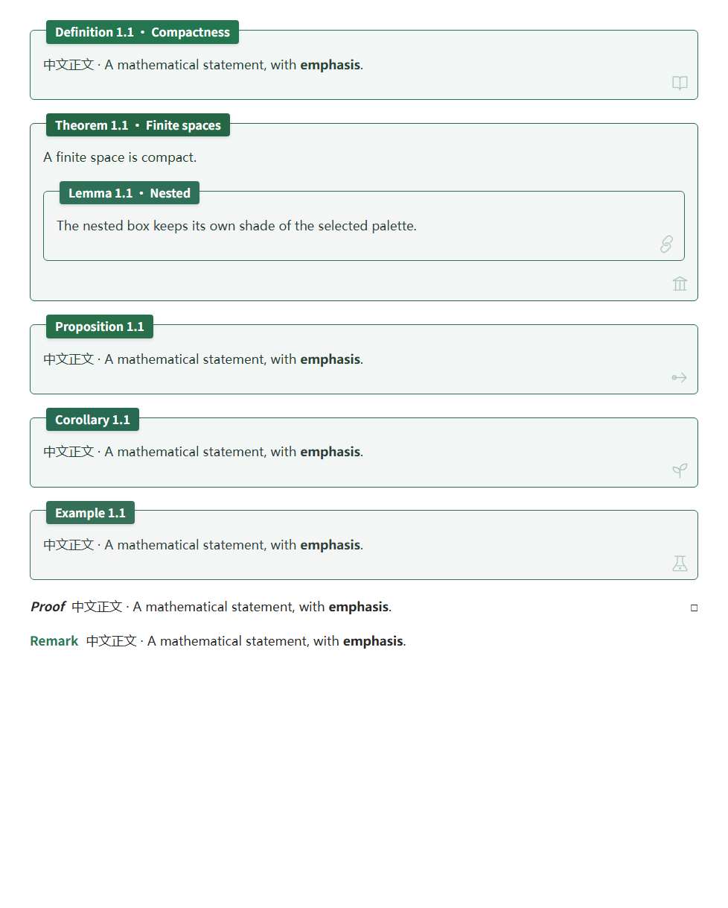
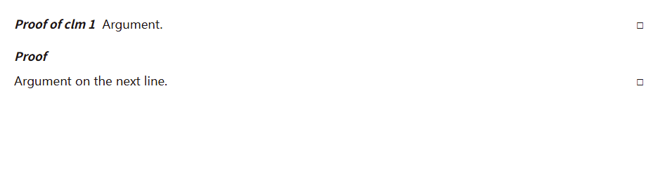
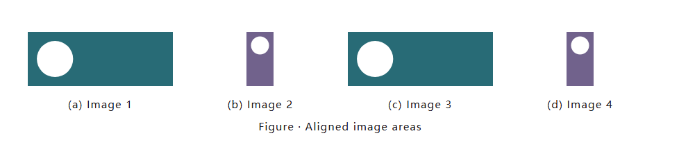
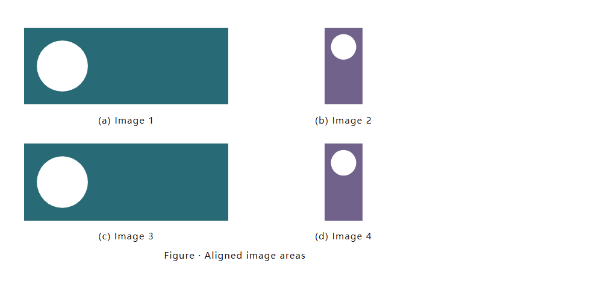
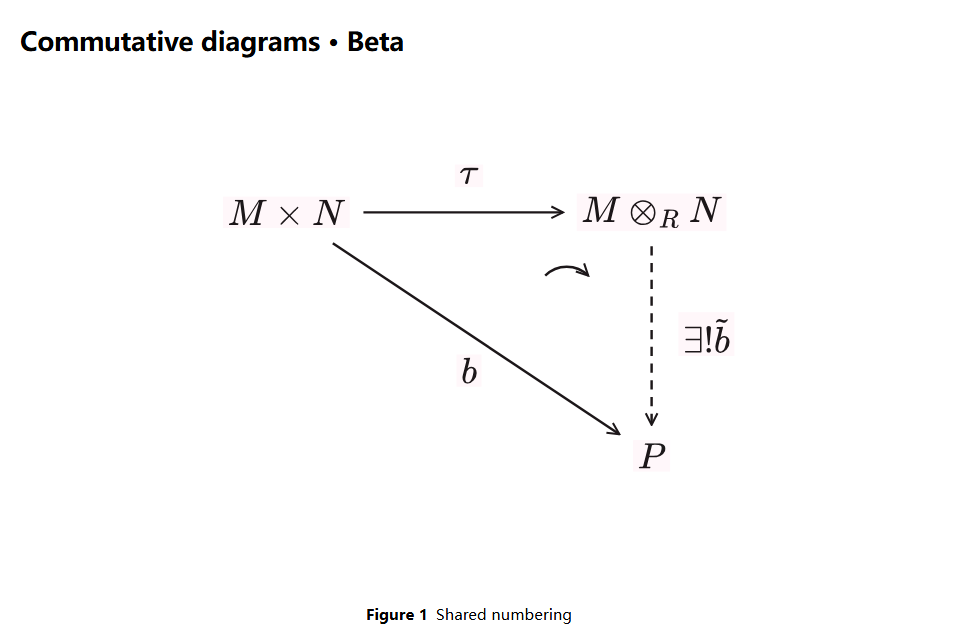
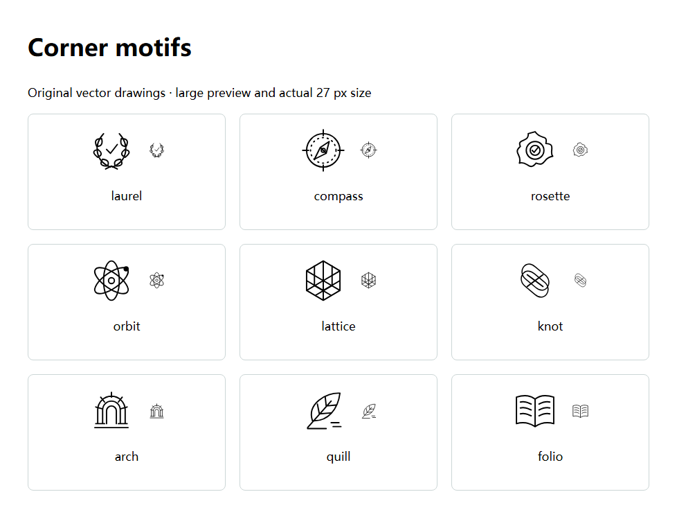
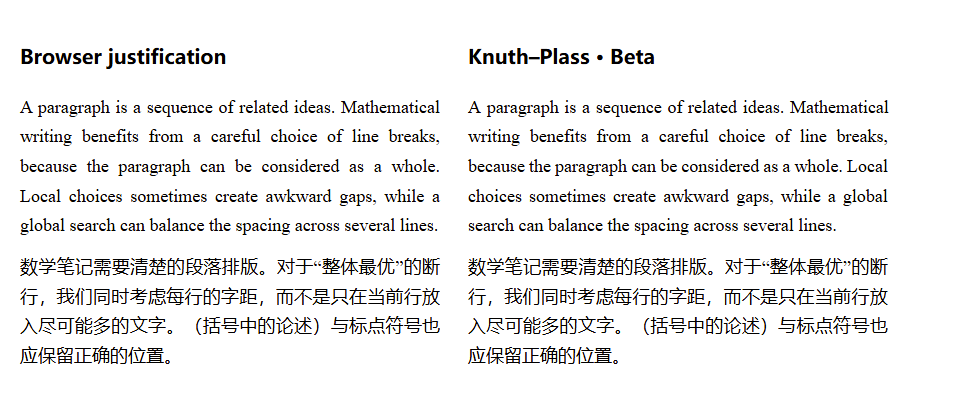
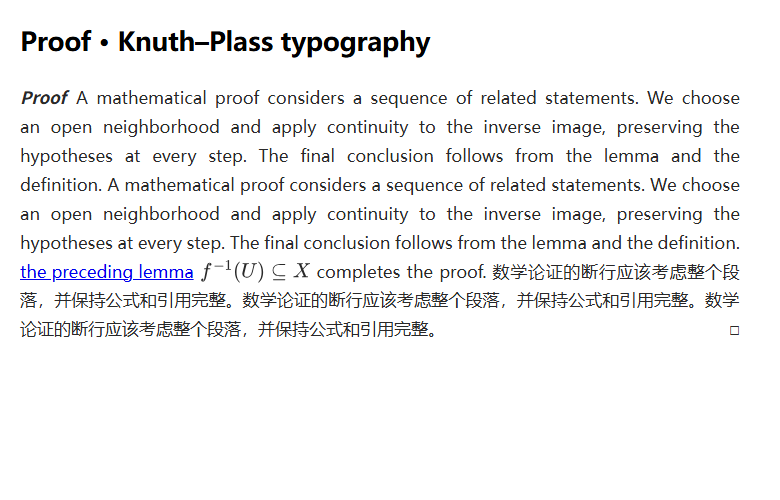

# Academic Notes

[English](README.md) | **简体中文**

**LaTeX-like numbering, cross-references and local PDF export for Obsidian.**

数学环境、公式、图表与子图自动编号；跨文件块引用、目录和多篇笔记合订本。配色独立于特定主题，PDF 使用 Obsidian 自带的 Electron，安装后无需 Python、Chrome 或其他外部程序。

数学环境的视觉设计受到 [ElegantBook](https://github.com/ElegantLaTeX/ElegantBook) 启发：定理使用带标题的数学框，证明使用简洁的行内标题和结束方框，注记使用彩色行内标题。颜色随 Academic Notes 当前色板变化。

界面自动跟随 **Obsidian → 设置 → 通用 → 语言**：中文语言使用简体中文，英文及其他暂未翻译的语言使用英文。更改语言后重启 Obsidian 即可生效。设置、下拉选项、命令、弹窗、诊断和导出提示均支持中英文；笔记正文、自定义标题、引用语法和已保存的设置保持不变。



## 安装

需要 Obsidian 1.9.0+，桌面或移动端均可安装。可在第三方插件目录安装；若暂未显示，则将 [最新 Release](https://github.com/Kristal-Boltinn/academic-notes/releases/latest) 的三个文件放入笔记库的 `.obsidian/plugins/academic-notes/`：

```text
academic-notes/
├─ main.js
├─ manifest.json
└─ styles.css
```

在「设置 → 第三方插件」启用 **Academic Notes**。iPad 可用编号、引用、数学框和 HTML 快照；PDF 导出仅在桌面版显示。图表布局已内置，不需要再启用 CSS 片段。插件设置保存在本机 `data.json`；不要将它上传到公共仓库。

仅需三线表和手写图表题注布局、不需编号时，可以单独使用 [snippets/academic-layout.css](snippets/academic-layout.css)，复制到 `.obsidian/snippets/` 后在外观设置中启用。

## 数学框与引用：最小示例

```markdown
## 连续映射

> [!def] 连续性
> 若每个开集的原像都是开集，则称映射连续。

^def-continuity

> [!thm] 复合映射
> 两个连续映射的复合仍连续。

^thm-composition

根据 [[#^def-continuity]] 可以证明 [[#^thm-composition]]。

> [!proof]
> 逐次取原像即可。
```

默认显示 `Definition 1.1 · 连续性` 和 `Theorem 1.1 · 复合映射`；链接显示 `def 1.1`、`thm 1.1`。不同类型默认分别计数。点击引用跳转到目标。

| 环境 | 支持的类型名 | 自动编号 |
|---|---|---|
| 定义 | `def`、`definition` | 是 |
| 定理 | `thm`、`theorem` | 是 |
| 引理 | `lem`、`lemma` | 是 |
| 命题 | `prop`、`proposition`、`prp` | 是 |
| 推论 | `cor`、`corollary` | 是 |
| 断言 | `claim`、`clm` | 是 |
| 例子 | `example`、`ex`、`exa`、`exm` | 是 |
| 公理 | `axiom`、`axm` | 是 |
| 假设 | `assumption`、`asm` | 是 |
| 习题 | `exercise`、`exr` | 是 |
| 猜想 | `conjecture`、`cnj` | 是 |
| 假说 | `hypothesis`、`hyp` | 是 |
| 证明 | `proof`、`pf` | 否 |
| 注记 | `remark`、`rem`、`rmk` | 否 |
| 解答 | `solution`、`sol` | 否 |

`> [!thm]- 标题` 为默认折叠，`> [!thm]+ 标题` 为默认展开。嵌套框每层增加一个 `>`；导出时展开折叠内容。

手写编号：`> [!thm|A.1] 标题`。不编号：`> [!thm|*] 标题`；`|-` 和空元数据 `|` 也表示不编号。省略元数据或 `|auto` 表示自动编号。自动计数避开同一计数范围内已有的相同手写编号。

## 证明与注记

使用 `proof` 环境书写不编号的证明。起始行不写标题时，斜体 **Proof** 独占一行，正文从下一行开始。证明末尾自动出现空心方框 **□**，无需手写结束符号。有自定义标题或引用时可以与首段并排；在起始行后加一个空的 `>` 行，也可以让正文另起一行。

```markdown
> [!proof]
> 设 $U$ 为开集。由于 $f$ 和 $g$ 连续，
> $f^{-1}(U)$ 和 $g^{-1}(f^{-1}(U))$ 都是开集。
>
> 因而复合映射 $f \circ g$ 连续。
```

证明先前声明的 Theorem、Lemma、Claim 等环境时，把对应块引用直接放在标记后：

```markdown
> [!proof][[第一章#^claim-a]]
> 这里填写证明。
```

会显示 **Proof of clm 1.1**，引用可以点击跳转。`> [!proof] [[#^thm-a]]` 也支持。显示随引用缩写、手写别名和合订本章号变化；引用目标请使用数学环境的块 ID。



使用 `remark` 环境书写注记。**Remark** 标题采用当前色板主色的明亮同色系，正文使用普通笔记文字颜色，没有外框、底色或结束方框。

```markdown
> [!remark]
> 这个论证只用到了开集的原像，适用于一般拓扑空间。
```


两种环境的正文始终使用普通文字颜色。`pf` 是 `proof` 的别名；`rem`、`rmk` 是 `remark` 的别名。可用 `> [!proof] 复合映射` 添加标题，也支持 `+`/`-` 折叠写法、嵌套和多段内容。以列表或独立公式开头时，标题单独占一行；以它们结尾的证明会在最后另起一行显示方框。长证明导出 PDF 时可跨页，方框只出现在整个证明末尾。

## 公式编号

```markdown
## 恒等式

$$
a^2+b^2=c^2
$$

^eq-example

由 [[#^eq-example]] 得到结论。
```

默认仅为**全库中被引用**的独立 `$$...$$` 公式自动编号，未引用的公式不占号。可设为全部编号或关闭自动编号；行内公式不编号。

保留手写 `\tag{A}`；没有手写编号时，`\notag` / `\nonumber` 阻止自动编号。一个公式块对应一个自动编号。需要逐行引用时拆成不同块。一个块含多个手写 `\tag` 时保留原式，不猜测整块引用编号。

## 跨文件引用和命令

```markdown
同文件：[[#^thm-composition]]
跨文件：[[第一章#^thm-composition]]
手写文字：[[第一章#^thm-composition|复合映射定理]]
Markdown 链接：[复合映射定理](第一章.md#^thm-composition)
```

块 ID 只使用英文字母、数字、连字符，一篇笔记内必须唯一。块结束后空一行，再单独写 `^id`。嵌套块建议使用命令自动添加，避免引用层级放错。

在命令面板（Windows：`Ctrl+P`）搜索 Academic Notes：

- **为光标所在公式、定理或图表添加块 ID**：为当前块写入唯一 ID。
- **插入定理、公式或图表引用**：选择已有 ID 的目标并插入链接。
- **重建定理公式索引并刷新引用**：手动刷新。
- **插入或编辑交换图（Beta）**：打开点阵编辑器，或重新编辑光标所在的交换图代码块。

输入 `\ref`、`\tref` 或 `\eqref` 可触发引用建议，后两种分别筛选数学框和公式。阅读模式和实时预览替换链接显示；源码模式保留写法，实时预览中光标进入链接时也恢复源码。默认保留手写链接别名。

## 编号设置

| 设置 | 说明 |
|---|---|
| 按 H2 分节重置（默认） | 每遇源码中的 `##` 重置计数器；H3–H6 不参与 |
| 编号前加入 H2 节号 | 开启为 `2.1`；关闭为 `1`，但仍按 H2 重置 |
| H2 节号来源 | 按出现顺序，或优先取 `## 3.2 标题` 开头的数字 |
| 整篇连续编号 | 不按 H2 重置，不添加 H2 节号 |
| 不同定理类型共享计数器 | 开启后定义、定理等共同计数；公式、图、表仍独立 |
| 编号前缀 | 手动指定；不会从日期或文件名猜测 |
| 排除索引的路径 | 相对库根目录的文件或目录，每行一个 |

有 H2 时，首个 H2 前属于第 0 节；完全没有 H2 时省略节号。代码块、公式、注释中的标题不计入分节。

公式引用格式默认 `eq:{number}`；数学框默认 `{type} {number}`。`{type}` 受缩写开关控制，`{abbr}` 始终缩写，`{name}` 始终全称；还支持 `{title}`、`{file}`。图表默认 `fig {number}` / `tab {number}`。

## 图、表与子图

题注写在 Callout 标题中。图注在图下方，表注在表上方，表格使用三线表。图片路径换成库中实际存在的文件。

```markdown
> [!figure] 函数曲线
> ![[附件/曲线.svg]]

^fig-curve

> [!table] 参数
> | 参数 | 数值 |
> | --- | --- |
> | $a$ | 1 |
> | $b$ | 2 |

^tab-parameters

参见 [[#^fig-curve]]、[[#^tab-parameters]]。
```

子图必须嵌套在主图内：

```markdown
> [!figure] 两种状态
> > [!subfigure] 初始状态
> > ![[附件/初始.svg]]
>
> ^fig-initial
>
> > [!subfigure] 最终状态
> > ![[附件/最终.svg]]
>
> ^fig-final

^fig-states
```

子图显示 `(a)`、`(b)`；引用 `[[#^fig-initial]]` 显示例如 `fig 1.1(a)`。窄窗口自动换行。孤立的子图只显示题注并给出诊断警告。支持别名 `fig`、`tbl`、`subfig`。

普通图片不从 alt 文本猜测题注。**H6 始终是六级标题**；图表必须使用明确的 Callout 语法。

可选笔记属性：

```yaml
---
cssclasses:
  - academic-serif
  - academic-indent
---
```

`academic-serif` 使用本机可用的衬线字体；`academic-indent` 让普通段落首行缩进，框内、列表等不缩进；`academic-keep-table-style` 保留主题的表格样式。

子图不需要题注时，写 `> [!subfigure]`，右括号后不填标题即可。未被引用的无标题子图只显示图片，不显示字母，也不留题注空白或占用字母序号；下一幅有标题的子图仍从 `(a)` 开始。仅有块 ID 不会强制显示标签；如果有链接实际引用了该 ID，或手动指定编号，则保留可识别的标签。手动设置的折叠控件在笔记中仍可操作，PDF 不保留空题注。

### 快捷插入与图组布局

在命令面板运行 **Academic Notes：插入学术环境**，也可在 Obsidian 的快捷键设置中为此命令绑定按键。可选定理、定义、证明、注记、单图、子图组、表格；子图组可选择 2–12 幅、最大列数及可选的统一图片高度。命令在当前行前插入完整结构（位于 callout 内时插入到所属引用块之前），保留原文并选中标题，自动生成与当前笔记已有 ID 不冲突的块 ID。把示例图片路径改成自己的附件即可；之后仍可直接编辑 Markdown。

统一设置写在**外层 figure**，例如：

```markdown
> [!figure|cols=auto height=180] 对比图
> > [!subfigure] 横图
> > ![[Attachments/wide.png]]
>
> > [!subfigure] 竖图
> > ![[Attachments/tall.png]]
```

- `cols=auto`：两幅最多两列、四幅最多四列，其余最多三列。四列直接变两列，再变一列；四幅不会出现 3+1。同组单元格等宽，最后一行未满时居中。
- `cols=1`、`2`、`3`、`4`：指定最大列数，窄图组仍会减少列数；四列上限同样跳过三列。换行依据图组本身的宽度，分栏阅读和 PDF 页面均适用。
- `height=180` 或 `height=180px`：每幅子图使用相同的目标高度 180 像素。图片等比例完整显示、不拉伸、不裁剪；如果最宽图片放不进当前列，整组会一起降到相同的较小高度。此设置会覆盖本组图片自身的 `![[图片.png|300]]` 宽度。图片文件本身自带的白边仍会保留。允许 16–1200 像素；PDF 导出时会按比例缩小过高图组，具体限制见下文“图片跨页保护”。
- 不写 `height` 就保留单张图片的宽度设置。图组参数不影响普通图片；无效参数值会忽略。可与编号参数合用，例如 `|A.1 cols=2 height=180`、`|* cols=2`。





如果喜欢缩写展开，可选用附带的 [LaTeX Suite snippets](examples/latex-suite-snippets.js)：提供 `subfig2`、`subfig3`、`subfig4`、`subfig6`、`athm`、`aproof`、`aremark`。将条目合并进已有 snippets 数组，在顶层空行输入缩写并按 Tab 展开，再按 Tab 逐项填写，详见 [LaTeX Suite 文档](https://github.com/artisticat1/obsidian-latex-suite/blob/main/DOCS.md)。这些 snippets 不生成 ID；需要引用时用插件的添加块 ID 命令。内置插入命令不依赖其他插件。

## 交换图编辑器（Beta）



1. 在命令面板运行 **Academic Notes：插入或编辑交换图（Beta）**，选择 2×2 或 3×3 网格。
2. 点击一个点启用／选择节点，在“节点公式”中填写 `M \otimes_R N` 等 LaTeX 公式，支持直接输入 `\alpha`、`$\alpha$` 或 `\(\alpha\)`。优先保留 Obsidian 的 SVG 公式；宿主返回 CommonHTML 等格式时，由内置的本地 TeX／AMS 渲染器生成 SVG，无需额外插件或联网。“启用当前节点”开关可以关闭节点。
3. 切到“连接箭头”，依次点击起点和终点。点击预览中的箭头或箭头列表按钮选中它，再填写标注，设置实线／虚线、标注在上／下或左／右的位置。“删除当前箭头”只删除所选箭头。“撤销”可以恢复近期修改，包括缩小网格时删除的节点。
4. 表示三角图交换时，先连接 **A→B、B→C、A→C** 三条箭头，再选择“**标记交换**”，依次点击 **A、B、C**。三角区域内会出现短的四分之一圆弧箭头。点击弧线或对应列表按钮选中，用“删除当前交换符”移除；删除依赖的节点或箭头时，交换符也会移除，可用撤销恢复。
5. 可选填“图注”，然后点击“保存交换图”。数据保存在笔记的 `academic-diagram` JSON 代码块中。图下的“编辑交换图”可以重新打开编辑器；“删除交换图”可直接在阅读模式或实时预览删除整张图，无需切到源码模式。

Beta 支持直线箭头、每个有向点对一条箭头、2×2／3×3 点阵，以及最多 200 字符的单行标签。公式通过宿主 SVG 或内置本地渲染器生成，并与箭头共用 SVG 坐标，适应移动端窄屏。最多添加 12 个三角交换符；三个节点不能共线，且必须存在对应的三条有向箭头。标记只表达你声明的路径相等，不自动验证数学结论。弧线自动放置在三角区域内，暂不支持手动移动或更一般的路径标记。阅读模式和实时预览均可显示，也可保存进 HTML／PDF。

独立交换图与普通图片**共用 Figure 编号**，按原文顺序计数，图注可以留空。新建交换图会自动添加唯一的 `^fig-diagram-N` 块 ID，可用 `[[#^fig-diagram-1]]` 或跨文件链接引用。旧图可以在代码块后手动添加 ID，或运行“为光标所在公式、定理或图表添加块 ID”。已经放在 `figure`／`subfigure` 环境里的交换图使用外层图注，不重复计数。删除独立图时会一并清理紧邻且属于它的块 ID。完整可编辑示例见 [examples/commutative-diagram.md](examples/commutative-diagram.md)。

## TikZ 绘图：可选 TikZJax 插件

在 Obsidian 社区插件中安装并启用 [TikZJax](https://github.com/artisticat1/obsidian-tikzjax)。通过“插入学术环境 → TikZ (TikZJax)”可以插入起始模板，也可以手写：

````markdown
```tikz
\usepackage{tikz}
\begin{document}
\begin{tikzpicture}
  \node (A) at (0,0) {$A$};
  \node (B) at (3,0) {$B$};
  \draw[->] (A) -- (B) node[midway,above] {$f$};
\end{tikzpicture}
\end{document}
```
````

TikZJax 还提供 `tikz-cd` 包，可手写更复杂的交换图，具体支持范围见其文档。Academic Notes 导出时会等待最多 60 秒，保留完成的 SVG，并隔离多图、多章节的字形 ID。缺少插件或渲染未完成时会停止导出并说明原因。需要编号和图注时，把 `tikz` 代码块放进 `figure` 环境。

## 配色：哪些会跟随主题？

浅色：Forest（默认）、Sakura、Mint、Sky、Mauve、Golden、Cherry、Prussian。深色：Radiation（默认）、Vampire、Abyss。每套按数学环境区分颜色。浅深模式跟随 **Obsidian 当前模式**；Obsidian 设为跟随系统时，会间接跟随系统的浅深模式。

**跟随 Obsidian 主题配色**不会匹配某套预设，也不直接读取操作系统主色调。定义取主题公开的 `--text-accent`，定理/断言取蓝色，引理取紫色，命题取绿色，推论取青色，例子取橙色，解答取次要文字色，再混入普通正文色。注记标题取定义主色的明亮同色系，证明标题使用普通文字色。选择固定色板即可让边框与底色色系独立于主题。

**框内正文使用普通正文色**：开启后，带框环境的正文和笔记普通文字同色；关闭时混入 36% 当前框色。证明和注记的正文始终使用普通文字色。该选项不改变字体、标题、边框或底色；链接和代码保留各自语义样式。

浅色框内部为 **6% 框色 + 94% 白色**，深色框为 **8% 框色 + 92% 中性深灰**，避免彩色页面背景使框内部偏色。嵌套框各用自己的颜色。右下角装饰图案可单独隐藏，此开关不会隐藏证明末尾的方框。可选 Style Settings 可调边框粗细、圆角大小（0 为直角）、角标大小和透明度。

进入 **设置 → Academic Notes → 环境自定义**，选择 Theorem、Definition、Axiom 等环境，打开对应颜色开关即可分别指定浅色和深色模式的主色。关闭开关恢复当前色板；边框、标题底色和浅色同色系背景同步更新，标题文字自动选择黑色或白色。Proof 和 Remark 保持无框段落，自定义主色仅改变标题。

有框环境还可分别设置浅色／深色角标颜色，并选择原有图案、无角标，或九款细线矢量图案。点击图案即可选用，下方预览显示当前模式的效果。“恢复此环境默认外观”仅清除当前环境的自定义。全局“隐藏右下角小图案”优先，且不影响 Proof 的结束方框。PDF 导出保留自定义外观，包括关闭主题捕获时。



## 段落排版（Beta）



进入 **设置 → Academic Notes → 段落排版（Beta）**。三个 KP 开关及首行缩进选项默认关闭，可分别使用：

| 设置 | 用途 |
|---|---|
| 正文首行缩进两个汉字 | 阅读、实时预览及导出中的文字段落首行缩进 2em，包含数学环境正文；可独立于 KP 使用，不往笔记写空格。标题、列表、代码、题注和表格不缩进。 |
| 阅读视图使用 Knuth–Plass 断行 | 在桌面或移动端的阅读视图优化正文及数学环境；可用宽度或字体变化后重新排版。 |
| 实时预览使用 Knuth–Plass 断行 | 优化未编辑的独立普通段落和只读数学环境正文；光标或选区进入时恢复原生编辑，离开后重新优化。 |
| PDF 使用 Knuth–Plass 断行 | 在桌面导出单篇笔记或合订本 PDF 时，按最终打印宽度优化段落。 |

Knuth–Plass 会整体比较一个段落的断行方案，并调整字词间距，以减少各行疏密不均。支持基本拉丁文字和中日韩字符，并处理常见中文标点的断行限制。行内链接和公式保持完整，作为不可拆开的整体参与排版。开启阅读视图开关后，把笔记切换到**阅读视图**，可在不同窗口宽度下比较效果。首行缩进在 KP 选择断行前预留左侧空间，非末行的右边缘仍保持一致，不会在右侧再留两个字的空隙。不需要改写 Markdown，原笔记内容保持不变；源码模式沿用原有编辑排版，HTML 快照沿用浏览器的响应式排版。

Proof、Remark、定理、定义等数学环境正文也使用相同算法。行内标题会占用第一行的一部分宽度，后续行恢复完整宽度；证明最后一行会给唯一的结束方框留出位置，PDF 跨页后仍只显示一次。过长或跨多行的浮动标题沿用原生排版。优化后的非末行填满可用宽度，段落最后一行保留自然间距。若完整行内公式使断行困难，有限的第二次尝试按实际显示的间距评价方案；实际行宽的小偏差通过可伸缩间距校准；公式结尾行的显示包装会消除主题添加的尾端外边距，原始公式节点及 LaTeX 内部间距保持不变。公式作为不可拆开的整体，当前行余量不足时会移到后续行；超过整行宽度或无法适配的内容沿用原生排版。



此 Beta 暂不自动为英文单词添加断词连字符。列表、表格、标题、题注、图片段落、显式换行，以及从右向左或竖排文字均沿用普通排版。复杂标记、无法适配宽度的段落和超过处理上限的内容也会自动回退，因此长笔记可能只优化部分段落。效果取决于文字、字体和宽度，并非每一段都会改善。

**实时预览**对可编辑普通正文仍采用较小的 Beta 范围：只处理源码中写为一行、前后为空行（或文件边界）、没有行内 Markdown 格式的独立普通段落。含公式、链接、强调和多源码行的普通段落仍采用浏览器断行，但开启实时预览 KP 时保留浏览器两端对齐；正在编辑的正文也保留两端对齐。列表和代码维持原有排版。这种回退没有进行全段 KP 优化。只读数学环境正文额外支持行内公式和链接；光标或选区进入环境后恢复原生正文，编辑标题时由 Obsidian 管理原生节点；标题仍带可编辑属性但已不在编辑时，不会单独阻止只读正文使用 KP。即使焦点改变，只要原生光标仍在环境内，就推迟进一步更新；触屏滑动和惯性滚动结束后才继续排版。复制选区存在时推迟重新排版，关闭开关或移除扩展会恢复原生内容。选中的全部段落和输入法组合输入期间恢复原生编辑。仅优化可见正文，并限制工作量；很大的笔记维持原生。不会插入源码换行或修改笔记文字。阅读视图与 PDF 保留原有行内内容支持。

## 目录

独立段落写 `[toc]`，或使用带深度的代码块：

````markdown
```academic-toc
3
```
````

支持深度 1–6，省略则用设置值。笔记中的目录可点击；PDF 目录的页码通过实际打印测量得到，并建立 PDF 书签。

## PDF / HTML 导出

**无需安装导出引擎**。运行「直接导出当前笔记为 PDF」或「导出当前笔记为 HTML 快照」。HTML 是静态快照；修改笔记后需要重新导出。

多篇导出运行「选择多篇笔记并导出合订本 PDF」，勾选文件、调整顺序和标题。也可创建清单笔记：

```yaml
---
phb-book:
  title: Analysis Notes
  subtitle: A sample collection
  tocDepth: 3
  files:
    - 第一章.md
    - path: 第二章.md
      title: 第二章：连续映射
---
```

`phb-book` 是笔记顶部 YAML 属性里的合订本章节清单，不是目录或额外插件。单篇直接导出不需要它；也可以使用多篇选择窗口而不写清单。

打开清单运行「按 phb-book 清单导出 PDF」或 HTML 命令。路径相对库根目录，按清单顺序组章；清单本身不作为章节。

合订本编号有三种：**章.节.序号**（默认，如 `2.3.1`）、**章.序号**（章内连续，如 `2.1`）、**保留库内显示编号**（可能跨章重号）。无 H2 或首个 H2 前，在章.节模式属于第 0 节。前两种在导出副本中重新编号，原笔记不变。跨文件目标要纳入本次导出，否则报告提示未解析引用。

「PDF 捕获当前主题与片段样式」开启时复制当前 CSS，关闭时用内置数学框、图表和打印样式；都保留当前浅深模式和色板。折叠框展开，长框允许跨页，过宽 SVG 公式按可用宽度缩放。

默认输出到库内 `_exports/`；只能使用库内相对目录，不能使用绝对路径或 `..`。生成带时间戳的 HTML 快照、快照报告、PDF 和分页校验报告。最多进行 6 轮目录校准，未收敛、图片/公式/字体错误或内部链接无效时停止输出，不猜测页码。

### 图片跨页保护

PDF 使用 A4 页面。能放进一页的整幅图、子图组和图注会保持在一起；当前页剩余空间不足时移到下一页。超高图会按比例缩小到页面可用高度，普通图片也有保护。若图注本身过长，缩小图片后仍超过一页，则允许长图注分页。报告中的 `mediaPagination` 记录保护组数、缩放组数和仍过大的组数。

### 图片浮动排版（实验）

桌面版进入「设置 → Academic Notes → 图片排版优先级（实验）」。默认“直接留白（关闭）”，可选：

| 优先级 | 行为 |
|---|---|
| 缩至 80% → 移动 → 留白 | 先把图片宽高缩至 80%；整组能放入当前页就保留原位置，否则尝试用后文填补空白。 |
| 移动 → 缩至 80% → 留白 | 先尝试让后文提前，再尝试缩图。 |
| 仅缩至 80% | 缩图能放下就缩，否则保留原顺序。 |
| 仅移动 | 尝试让后文提前，否则保留原顺序。 |

移动只允许独立 `figure`／`fig` 后面最多三个连续普通段落提前，完整图片与图注留在下一页；遇到标题、数学环境、列表、表格或其他图片立即停止。环境内部的图片不移动，也不会移入其他环境。使用实际 PDF 测量验证完整图片和提前段落的首尾；若跨页则拒绝这次调整。图注字号保持不变，原笔记和编号顺序不改写。

“最大图片调整次数”可设为 1、3、6（默认）或 10，限制整次导出的试调总次数。超过次数后若仍需调整，会撤销本次全部实验调整，恢复正常留白。目录校准后再次检查；若边界改变或实验布局导致目录不稳定，同样恢复正常排版。正常排版的目录若仍校准失败，会报告导出错误。分页报告的 `figureLayout` 包含试调、缩图、移动、跳过计数与回退原因。

这是针对显式图环境的有限实验。独立交换图、未包进环境的图片、表格和很长的文字图注不自动浮动，仍使用常规跨页保护。HTML 快照保持原顺序。合成示例见 [examples/figure-floating.md](examples/figure-floating.md)。

## 隐私和权限

- 本地索引库内 Markdown，以解析跨文件引用；支持排除文件/目录。无账号、遥测或开发者服务器，不传输笔记内容。
- 插件不安装程序、不启动外部命令、不下载运行依赖。Electron 和 PDF 后处理都在本机执行。
- 安装后的插件不调用 Node 文件系统接口。PDF 打印通过内存 Blob 在隔离的隐藏窗口中加载快照，不在库外创建临时 HTML 文件。打印窗口禁用 Node 集成、文档脚本、网络请求、本地文件请求和权限请求。普通外部链接可保留为 PDF 链接，不会因导出自动访问。
- 为保存主题外观，快照可能读取本机已加载的 CSS、字体和图片资源，包括主题引用的库外本地资源。这些资源仅内嵌进本地快照；关闭捕获主题可减少主题资源读取。
- 导出文件与报告只写入库内指定目录。报告可能包含文件路径、标题和警告；公开分享前应检查内容。
- 网络图片请先保存到库内。插件不会在导出时下载远程图片或 CSS 资源。Obsidian 和其他插件自己的网络行为不由本插件控制。
- 自动索引和导出不改写笔记；添加块 ID、插入引用/环境以及保存或删除交换图会按用户操作编辑笔记。交换图数据存储在笔记代码块中，不上传至服务器。TikZJax 是独立安装的可选插件，其自身权限和行为请参阅其说明。

## 查看导出失败原因

导出进度窗口会显示错误。关闭窗口后，用命令面板运行「检查插件状态与导出环境」，查看 `errors` 和 `lastPdfExport`；点击「保存诊断 JSON 到导出目录」保存到默认 `_exports/academic-diagnostics-*.json`。错误历史保留在当前插件会话，重载前请保存。`pdf.interfaceAvailable` 只检查接口存在，不代表导出成功。成功导出才会生成 `.report.json`；失败时 `.phb.html` 快照可能已经保存。更完整的日志可在 `Ctrl+Shift+I` 的 Console 中搜索 `[Academic Notes]`。

## 排错与兼容性

### 记录本机断行或滑动异常

如果 Proof 行尾参差或实时预览无法上下滑动，先打开有问题的笔记，在命令面板运行 **「开始记录排版与滚动诊断（90 秒）」**。先在阅读视图停留几秒，让有问题的段落出现在屏幕上，再切换实时预览、编辑 Proof 标题或正文并尝试滑动。保持同一篇笔记打开。可运行 **「停止并保存排版与滚动诊断」**，或等待 90 秒后自动停止。

记录立即保存，此后每 15 秒保存一次，文件为 `_exports/academic-layout-diagnostics-*.md`；如果你改过导出目录，则保存在设置的库内目录。即使必须重启应用，已经保存的检查点仍会保留。把 iPad 报告发给排错者，也可以在电脑录一份作对照；不需要 Mac 或远程开发工具。报告是包含 JSON 代码块的普通 Markdown 笔记，通过库 API 创建并在保存后读取校验。请在**笔记库根目录**查找，而不是插件文件夹。原有诊断窗口提供开始／停止、「查看记录」和「打开已保存报告」按钮；即使写入失败，仍可在窗口查看本次记录。旧 `.json` 报告可能被 Obsidian 的不支持文件过滤隐藏。

只有手动运行命令才开始记录。内容包括可见环境的尺寸、字体与排版／滚动样式、是否存在 KP 标记、实际行尾空隙、选区位置、触摸／滚动事件是否被其他处理器阻止、节点变动计数及插件排版活动。还记录视口尺寸变化和匿名的触点目标检查，帮助排查键盘／遮挡；记录期间只分类笔记外的触摸／指针事件，不记录其内容。记录有数量上限，停止或卸载插件会清理监听。不保存笔记文字、公式源码、文件名、块 ID、HTML、输入值或错误消息，不自动上传；不会改动笔记、主题、KP 开关或光标。报告包含字体／样式和设备／版本信息，分享前仍可自行检查 JSON。

没有 KP 标记的原生段落沿用浏览器断行。KP 开关默认关闭，阅读与实时预览须分别确认。诊断负责收集证据，不代表已修复 iPad 卡滚动。

| 问题 | 检查 |
|---|---|
| 公式未编号 | 默认仅编号被引用公式；检查 ID、路径、排除设置和 `\notag` |
| 引用未替换 | 手写别名默认保留；源码模式不替换；重复 ID 不解析 |
| 数学框或图表异常 | 停用重复的编号插件/数学框 CSS/布局片段，确认支持的 Callout 类型 |
| 框内颜色偏差 | 检查是否选择跟随主题；普通正文色开关只控制文字 |
| Electron 接口不可用 | 运行「检查插件状态与导出环境」，更新 Obsidian 桌面安装程序 |
| PDF 导出失败 | 查看进度窗口和报告；确认图片已存入库、公式和字体可正常加载 |
| 编号没有刷新 | 运行重建索引命令 |

同一个插件可在桌面和 iPad 上安装。移动端提供数学环境、编号、跨文件引用、目录、外观设置和 HTML 快照；PDF 命令只在桌面版显示，使用 Obsidian 自带的 Electron。最低应用版本 1.9.0 表示 API 下限，不代表所有设备组合都已实机验收。目前移动端通过模拟 Obsidian 宿主和发布包无 Node／Electron 加载测试，仍需在真实 iPad 上确认。若社区插件目录尚未显示本插件，可等待目录条目更新，或把发布页的三个安装文件同步到库内 `.obsidian/plugins/academic-notes/` 后在 iPad 的社区插件设置中启用。

## 开发与发布

Node.js 22+：

```sh
npm ci
npm test
npm run lint
npm run build
npm run test:electron
npm run check:release
```

`npm ci` 仅用于开发/CI，会安装测试用 Electron；用户安装的插件不运行它。`npm run dev` 监听源码。TypeScript 源码位于 `src/`，esbuild 将 pdf-lib 和 CSS 后备资源内嵌；构建只需分发 `main.js`、`manifest.json`、`styles.css`。`snippets/` 是可选独立布局，`examples/` 为合成示例，`tests/` 不使用个人笔记。

样式分别维护在 `src/styles/callouts.css`（数学环境和目录）、`src/styles/ui.css`（插件界面）、`src/styles/document.css`（导出排版）和 `snippets/academic-layout.css`（图表布局）。构建会展开嵌套 CSS，发布样式与导出快照使用同一份编译结果。

原生测试会启动隐藏的独立 Electron 测试窗口，将 README 示意图保存到 `screenshots/`，将 PDF 和报告保存到 `output/`。它验证真实 Chromium 打印和样式，不等同于真实 Obsidian 实时预览验收。可将环境变量 `ACADEMIC_TEST_THEME` 设为本机主题 CSS 路径，额外检查兼容性。完整的证明与注记示例见 [examples/proof-and-remark.md](examples/proof-and-remark.md)。

修改版本时同步 `package.json`、lockfile、`manifest.json`、`versions.json` 和 CHANGELOG。推送与 manifest 版本一致的 tag（例如 `2.5.0`）后，GitHub Actions 构建、测试并创建**草稿 Release**，上传三个安装文件；人工审阅后再公开。发布前按 [RELEASING.md](RELEASING.md) 核对作者、唯一 ID、实际桌面验收和 Community Directory 扫描。

## License

[MIT](LICENSE)。第三方依赖许可见 [THIRD-PARTY-NOTICES.md](THIRD-PARTY-NOTICES.md)。

## 支持与反馈

如果你觉得 Academic Notes 好用，欢迎在 [GitHub 上点一个 Star](https://github.com/Kristal-Boltinn/academic-notes) 支持项目。如果遇到任何问题，或有功能建议，欢迎[提交 Issue](https://github.com/Kristal-Boltinn/academic-notes/issues)。你的反馈会帮助插件持续完善。
